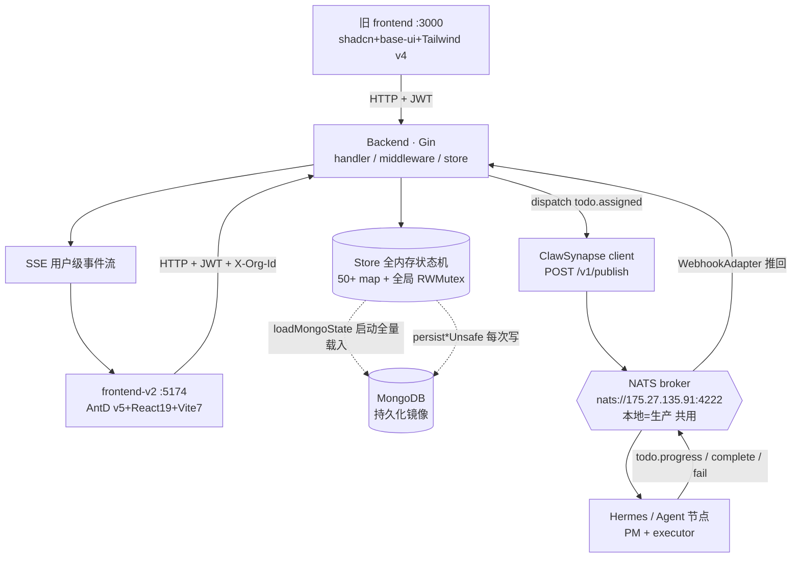
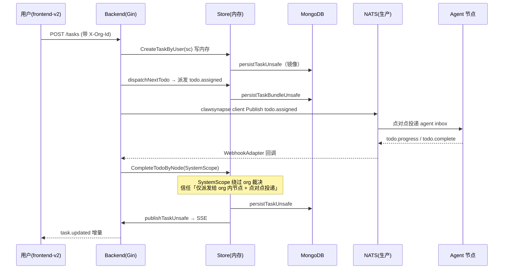

# TrustMesh 架构视角调研报告

> 调研人：高见远（Gao）· 架构师
> 日期：2026-09-11
> 视角：架构风险 + 技术债务 + 演进路线（不写业务代码，只做设计判断）
> 证据基线：`backend/internal/store/*`、`backend/internal/handler/*`、`backend/internal/middleware/*`、`backend/internal/clawsynapse/*` 源码 + `docs/` 架构/运维文档

---

## 1. 整体架构概述

TrustMesh 是一个面向影视/动画 AIGC 生产的「无人工厂」多智能体协作平台。其核心模型是 **项目（Project）× 角色 Agent × Todo 流水线**：PM Agent 把需求拆成任务与 Todo，执行 Agent 接力完成，平台（backend）只负责任务编排与状态聚合，Agent 执行在外部 ClawSynapse/Hermes 节点上。

### 1.1 核心组件与数据流

**关键事实（已代码核实）：**

- **状态层是全内存状态机，MongoDB 只是持久化镜像**。所有运行时状态都在 `Store` 结构体的 50+ 个 `map` 里（`backend/internal/store/store.go:35-149`：`users/agents/projects/tasks/taskEvents/orgEvents/opsIncidents/…`）。启动时 `loadMongoState()` 把**整个数据库全量读入内存**（`backend/internal/store/mongo_state.go:254-402`），每次写操作再通过 `persist*Unsafe`（`mongo_state.go:711-880`）`ReplaceOne` 回写 Mongo。Mongo 不是查询源，是镜像。设计文档 `multi-tenant-enterprise-plan.md §0` 已明确勘误：「主状态 = 全内存 map，Mongo 是持久化镜像」。
- **多租户隔离正在收敛但仍是「逐函数手工裁决」**。已建立 `store/scope.go` 统一裁决入口 `visibleToScope()` / `projectVisible()` / `agentCanWriteTaskUnsafe()`（`scope.go:39-156`），阶段 2（2-1…2-7）已把约 290 处散落的 `UserID` 引用批量迁到 `Scope` 参数。但仍有大量散落比较残留（见风险 R2），且内部路径靠 `SystemScope()`（`sc.System { return true }`）整体绕过租户裁决。
- **消息链路**：backend 不直接连 NATS，而是经 `clawsynapse` 本地节点的 Local API（`POST /v1/publish`）发出，Agent 回写经 WebhookAdapter 推回 `POST /webhook/clawsynapse`。`task.*` 走 responses、`todo.*` 走 runs（Hermes adapter），TodoMode 默认 runs。
- **实时层**：单条用户级 SSE 全局流（`GET /api/v1/events/stream`），事件类型收敛（`realtime-architecture.md`），React Query 为缓存真相源。

### 1.2 典型调用时序（任务派发 + Agent 回写）

---

## 2. 架构风险登记表

> 严重度：P0 = 生产可用性/数据安全/越权类，必须近期处理；P1 = 可维护性/扩展/正确性类；P2 = 技术债/优化类。

| # | 风险点 | 严重度 | 影响 | 根因（证据） | 建议 |
|---|--------|--------|------|--------------|------|
| **R1** | **全内存状态机 + Mongo 仅镜像** | **P0** | ① 重启 backend 即丢失全部**内存态**（未落盘部分）；② **无法水平扩展**（每实例全量载库、彼此状态发散，多实例会双派发/串状态）；③ 调试极难（状态不可观测、无外部查询入口）；④ 数据量增长后内存与启动时间线性膨胀（backfill 实测 events 4000 / tasks 142，规模尚小但趋势危险） | `store.go:35-149` 50+ map 为唯一状态源；`mongo_state.go:254-402` `loadMongoState()` 启动全量载入；`mongo_state.go:711-880` 每次写经 `persist*Unsafe` 回写；`multi-tenant §0` 勘误 | 见演进路线：把 Mongo 升级为**权威源**、内存降为读缓存/写缓冲；引入**写穿（write-through）或带 ack 的 write-behind**；评估事件溯源/CQRS（见待决策 Q2）；短期先加**启动快照 + 优雅停机落盘** |
| **R2** | **数据隔离散落 + 统一层未完全收敛** | **P0/P1** | ① 越权/串数据风险（曾实锤：跨用户同租户任务的 agent 回报被 404 吞掉，见 `scope.go:136` 山雨账号事件）；② 维护地狱：每新增资源都要手写 if；③ 多租户流量尚未真实跑起来（双前端仍单用户），隔离层未经攻击视角验证 | `multi-tenant §0`：实测散落 `UserID` 引用约 **290 处**（store 169 / handler 108 / 其它 14），store 内直接 `UserID !=` 比较约 90 处；Grep 在 `head_limit=50` 内即命中 50+ 处散落比较（`store_project.go:41/286`、`store_agent_chat.go:52/77/161`、`notification.go:63`、`store_agent.go:722` 等）；`scope.go` 已建统一入口但 `SystemScope`（`scope.go:47-49`）对 agent webhook/timeout_monitor/内部定时器**整体放行**，依赖「仅派发 org 内节点 + 点对点投递」的信任假设 | 完成阶段 2 收尾（残余散落 check 全部迁 `scope.go`）+ 阶段 5 越权专项测试（§7 清单）；把 `SystemScope` 信任假设收敛为**节点级租户绑定强校验**（阶段 3 已做 node token 但不强制）；隔离下沉到 Repository 层（见路线） |
| **R3** | **前端双轨并行** | **P1** | ① 维护成本翻倍（两套路组件/状态/样式）；② 功能分裂（多租户改造只在 v2，旧 3000 仍是单用户）；③ 改一处业务可能漏改另一轨（实锤：`prod-meeting-fix-2026-07-14.md` 因后端镜像落后前端导致「新建会议」404） | `multi-tenant §阶段4 R4`：「前端双轨（3000/5174）需同步改造」；旧 3000 = shadcn+base-ui+Tailwind v4，新 5174 = AntD v5+React19+Vite7；团队简报确认 v2「当前仍单用户」 | 制定**砍旧轨时间表**（见 Q1）；在砍掉前，所有 store/隔离改动必须同步两轨（已部分执行）；CI 强制两轨同测 |
| **R4** | **共享 NATS（本地 = 生产）** | **P0** | ① 本地误操作会向**真实生产节点**发重复指令（同一剧本写两遍/同一批资产出两遍图）；② 本地起任务即与生产抢指令，污染生产数据；③ 联调窗口必须互斥，开发效率受限 | `环境使用守则-本地开发生产运行-20260911.md`：「本地与生产**共用同一个 NATS broker** `nats://175.27.135.91:4222`」；`multi-tenant §0.5`：执行节点/转发节点/本地 backend 的 `natsServers` 全部指向同一生产地址；铁律禁止本地创建任务/触发 PM 规划 | 短期：制度化「本地 `docker stop trustmesh-clawsynapse` 静默」（文档已建议）；**中期：本地独立 NATS（方案 B）**，按环境彻底隔离；长期：多活按环境拆分 broker |
| **R5** | **Agent 行为无强约束 / 可观测性缺失（skill pruning 导致不合规）** | **P1** | ① Agent 因上下文压缩裁剪（skill pruning / `Context length exceeded`）不按设计执行，平台无强契约约束；② 平台只能靠**字符串匹配错误评论**做保活/判死（`liveness.go:23` 含 "Operation interrupted"/"Context length exceeded" 等 15 条特征），是权宜 stopgap；③ 节点侧上下文治理（N-04）与平台判定脱节，故障归因困难 | `liveness.go:23` `errorCommentPatterns`；`研发修复文档-平台可靠性缺陷-20260910.md` P-02/P-03/N-04（"上下文治理"）；agent 执行完全在外部节点，平台无法 enforce 行为 | 引入**节点侧能力契约（capability-contract）+ 结构化错误类型 `todo.error`**（文档已规划 N-07，应优先于字符串匹配）；平台侧对 Agent 执行做统一 SLA/重试/超时治理；把"进展/故障"从评论文本升级为协议字段 |
| **R6** | **生产可靠性/可观测性技术债（派生自 R1/R5）** | **P1** | ① 顺序派发曾**静默吞失败**（TD_04 停滞 56.5 min，已靠 `dispatch_reconciler.go` 自愈对账缓解）；② "超时 3 次判失败不重试"：`timeout_monitor.go:19` `defaultMaxReminders=3`、`:21` `defaultMaxRetries=3`——重试上限硬编码、无退避；③ 后端日志随容器丢失（文档 0.3 警告），故障无现场；④ 状态变更无审计轨迹（仅 events 流，且 events 也是内存镜像） | `timeout_monitor.go:14-22` 常量；`研发修复文档 P-01`；`multi-tenant §0` 内存态调试困难 | 告警/对账器已建，需**补额度水位监控 + remind 退避 + 升级人工**（P-08）；日志持久化（挂载 volume / 集中日志）；把关键状态变更纳入 CQRS 事件流（见 Q2） |
| **R7** | **全局锁 + 内存态并发模型脆弱** | **P2** | ① 单 `sync.RWMutex`（`store.go:19`）串行化所有读写，是并发瓶颈；② RWMutex 不可重入，`scope.go`/`meeting.go` 注释多次警告「持锁/懒加载边界搞反会 data race 或死锁」（`multi-tenant §2-5b 踩坑1`） | `store.go:19,33`；`scope.go`/`meeting.go` 持锁约定注释 | 演进路线阶段 2：按聚合（per-aggregate）细粒度锁或原子替换，替代全局锁 |

---

## 3. 推荐架构演进路线

> 总原则：**先止血（隔离收尾 + 消除生产误伤 + 状态不丢），再分层（Repository 接管 + 状态外置），最后弹性（多活 + 单前端）。** 所有改动沿用项目既有铁律：构建式部署（`build → stop → poll exited → rm -f → up -d --no-deps`），改 Mongo 前先停 backend。

### 阶段 1（短期，0–2 个月）：止血与隔离收口

**目标**：消除 P0 风险的可被利用面，把多租户隔离层从「建模完成」推进到「经攻击验证可用」。

- **1.1 隔离收敛收尾**：把 Grep 命中的残余散落 `UserID` 比较（`store_project.go:41/286`、`store_agent_chat.go:52/77/161`、`notification.go:63` 等）全部迁到 `scope.go` 裁决函数；阶段 4 前端双轨同步注入 `X-Org-Id`；跑通 `multi-tenant §7` 越权测试清单（12 条）作为回归守卫。
- **1.2 消除共享 NATS 误伤**：落地「本地独立 NATS（方案 B）」或至少制度化「本地 clawsynapse 默认 stop + 联调互斥窗口」；在 `docker-compose.yml` 显式区分本地/生产 NATS 地址，避免再指向 `175.27.135.91:4222`。
- **1.3 状态不丢的最小安全网**：backend 优雅停机时强制 `loadMongoState` 反向全量 flush（当前每次写已 `persist*Unsafe`，但需补「停机前确保内存→Mongo 落盘完成」的屏障）；加启动快照校验。
- **1.4 日志持久化**：后端日志挂 volume / 接集中日志，避免「容器重启即丢现场」（`研发修复文档 0.3`）。
- **业务中断影响**：低–中。1.1/1.3/1.4 纯后端、可灰度；1.2 改 compose 需一次维护窗。

### 阶段 2（中期，2–4 个月）：状态外置 + 统一数据访问层

**目标**：把「全内存状态机」演进为「Mongo 权威 + 内存缓存」，把隔离从「逐函数 if」下沉到 Repository 层。

- **2.1 状态持久化策略落地（R1）**：Mongo 升级为**权威源**；热路径改为 **write-through（先 Mongo 事务提交，再更新内存缓存）** 或带 ack 的 write-behind；每资源引入版本号/乐观锁，替代「全量内存 + 全局锁」。内存仅作读缓存与派发缓冲。
- **2.2 Repository 层接管（R2/R7）**：把 `store/` 的 50+ map 收敛为 per-aggregate Repository（Project/Task/Agent/Org/…），隔离 `Scope` 过滤内聚到 Repository 查询层，handler 不再感知租户细节；用 per-aggregate 细粒度锁替换全局 `RWMutex`，消除死锁风险。
- **2.3 Agent 行为契约（R5）**：节点侧落地 `todo.error` 结构化错误（N-07），平台侧优先按消息类型判定、字符串匹配降为兜底；统一 Agent 执行 SLA/重试/超时治理。
- **业务中断影响**：中。2.1/2.2 是存储语义重构，需双写过渡期 + 数据校验脚本（沿用 `org_backfill.js`/`org_verify.js` 模式），分集合灰度。

### 阶段 3（长期，4–6 个月+）：弹性、单前端、可选事件溯源

**目标**：支持水平扩展与多活，还清前端双轨技术债。

- **3.1 无状态 backend + 水平扩展**：backend 不再持有权威状态（阶段 2 已完成），可多实例部署；Mongo 为共享权威；可选引入 Redis 作热缓存。
- **3.2 砍掉旧 frontend（3000）**：统一到 frontend-v2（5174），关闭双轨维护成本（依赖 Q1 决策）。
- **3.3 多活与 NATS 环境隔离**：生产/预发/本地 NATS broker 彻底拆分；如阶段 1/2 证明需要审计/回放能力，再评估 **事件溯源/CQRS**（命令日志 + 投影），把"状态变更"显式化为可重放事件流（呼应 R6 可观测性）。
- **业务中断影响**：中–高，需编排迁移窗口；但每步可独立灰度。

---

## 4. 待明确事项 / 需用户决策（架构层开放问题）

1. **是否砍掉旧 frontend（3000）统一到 frontend-v2？** 双轨维护成本已实锤导致过故障（会议 404 事件），但旧轨仍有用户在用。决策影响路线阶段 3.2 与日常改动的「双轨同步」负担。建议给出明确 EOL 时间表。
2. **状态持久化采用哪种策略？** 「Mongo 权威 + 内存缓存（write-through）」是低成本演进；「事件溯源/CQRS」能顺带解决审计/回放/可观测性，但改动面与认知成本显著更大。范围差异大，需先拍板再开工（阶段 2.1）。
3. **NATS 是否拆分（本地独立 NATS 方案 B）？** 还是长期接受「本地 clawsynapse 默认静默 + 互斥联调窗口」？前者一劳永逸消除生产误伤，后者改动小但持续约束开发效率。
4. **`SystemScope` 信任假设是否可接受？** 当前 agent webhook / timeout_monitor 全部绕过 org 裁决，依赖「仅派发 org 内节点 + 点对点投递」。是否要把阶段 3 的 node-token 租户绑定**强制化**（不绑 org 的节点禁止接收生产派发），把信任假设变成硬校验？
5. **Agent 行为合规的治理边界？** 是否把「节点侧能力契约 + 结构化错误 `todo.error` + 平台统一 SLA/重试」定为**强制协议**（不合规节点拒绝接入），还是继续以字符串匹配兜底？这决定 R5 是「协议层根治」还是「长期 stopgap」。

---

## 5. 证据索引（关键 file:line）

| 论断 | 证据 |
|------|------|
| 全内存状态机 + Mongo 镜像 | `store.go:35-149`；`mongo_state.go:254-402`（loadMongoState 全量载入）；`mongo_state.go:711-880`（persist*Unsafe 回写）；`multi-tenant-enterprise-plan.md §0` |
| 散落 UserID 隔离 ~290/372 处 | `multi-tenant §0`（实测 290）；Grep `userID ==`/`.UserID !=` 于 `store_project.go:41/286`、`store_agent_chat.go:52/77/161`、`notification.go:63`、`store_agent.go:722` 等（head_limit=50 命中 50+） |
| 统一裁决入口 + P0 三选一修复 | `scope.go:39-56`（visibleToScope）；`scope.go:141-156`（agentCanWriteTaskUnsafe，山雨账号 2026-09-11 实锤） |
| SystemScope 绕过 org 裁决 | `scope.go:47-49`；`multi-tenant §2-5b`（SystemScope 显式系统旁路） |
| 前端双轨 | `multi-tenant §阶段4 R4`；`prod-meeting-fix-2026-07-14.md`（镜像落后前端 404） |
| 共享 NATS（本地=生产） | `环境使用守则-本地开发生产运行-20260911.md`；`multi-tenant §0.5`（natsServers 全指向 175.27.135.91:4222） |
| Agent 不合规 / skill pruning | `liveness.go:23`（errorCommentPatterns 含 Operation interrupted / Context length exceeded）；`研发修复文档 P-02/P-03/N-04` |
| 超时 3 次判失败不重试 | `timeout_monitor.go:19`（defaultMaxReminders=3）、`:21`（defaultMaxRetries=3） |
| 派发静默失败已缓解 | `研发修复文档 P-01`；`store/dispatch_reconciler.go`（自愈对账） |
