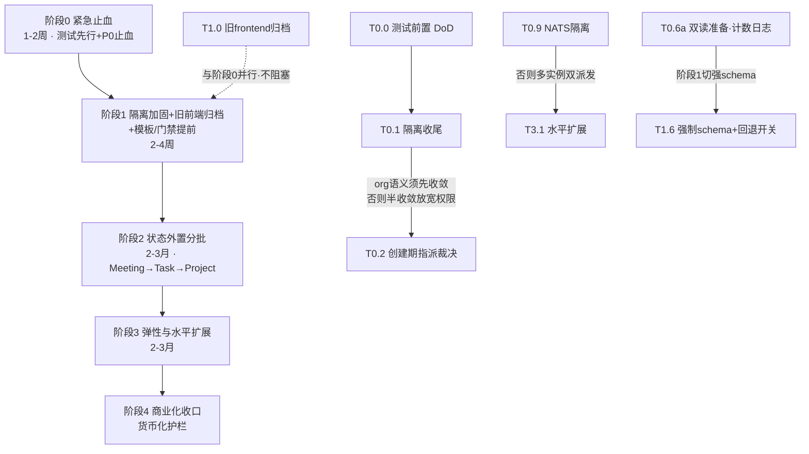

# TrustMesh 完整分阶段优化方案（实施蓝图）· v3

> 日期：2026-09-16（v3 最新状态同步版）
> 视角：架构 + 产品 + 工程 + QA 四视角收敛
> 输入：架构调研（`docs/architecture-review-2026-09-11.md`）+ 生产验收（T0.x/T1.x/T2.x）+ T2.5 回退决议（`docs/t2.5-rollback-decision-2026-09-16.md`）+ 智能体交接指南（`docs/dev-handoff-and-deployment-guide-2026-09-16.md`）
> 铁律：所有改动沿用 `build → stop → poll exited → rm -f → up -d --no-deps`；改 Mongo 前先停 backend；`git add` 按路径精确 add。

---

## 最新实施状态快照（2026-09-16）

| 阶段 | 规划阶段 | 当前交付状态 | 对应生产版本 / 关键结论 |
|---|---|---|---|
| **阶段 0** | **紧急止血 (T0.0–T0.12)** | ✅ **100% 全部交付上生产** | 测试先行、7处绑定吞错修复、自愈对账拉起 pending、有界优雅停机全部生效。 |
| **阶段 1** | **隔离加固与单轨收敛 (T1.0–T1.10)** | ✅ **已交付上生产**（除 T1.10 暂缓） | 旧前端彻底归档；前端单轨化（React19+antd v5）；第二租户全流程冷启动打通；工作流模板沉淀完成。T1.10 媒体规格待产品确认。 |
| **阶段 2** | **Mongo 权威与状态外置 (T2.1–T2.6)** | ✅ **四域权威全部上线** | **T2.1 会议 / T2.2 Task / T2.3 Project / T2.3b ProjectFile** 权威全部上线生产；**T2.6 幂等键**接入会议消息。**T2.5 细粒度锁调用点已安全回退**（保留底层基础设施与防竞争永久护栏）。 |
| **阶段 3** | **弹性与水平扩展 (T3.1)** | ✅ **100% 全部交付上生产 (双实例)** | **T3.1 无状态 Backend + 双实例水平扩展已全量上线**：Mongo 分布式 Leader 选举租约（`leader_leases`）、跨实例 SSE 广播 Outbox（`user_events`，延迟 0.286s）、容器 DNS 别名轮询分发、故障 30s 自动接管已灰度通过。 |
| **阶段 4** | **商业化收口** | ⏳ **规划中** | 配额强制已建已知缺口（G4）；质量看板卡 T1.10。 |

- **当前生产运行镜像**：Backend `20260916-151434`（双实例 `trustmesh-backend` + `trustmesh-backend-2`） / Frontend-v2 `20260915-140340`
- **详细交接与部署 SOP**：请参阅 `docs/dev-handoff-and-deployment-guide-2026-09-16.md`。

---

---

## 修订说明（v1 → v2）

依据三方评审 A/B/C/D 章 + 用户 3 项决策，v2 做如下修订：

### A. 修 3 条阻塞技术缺陷（工程师，必改）
1. **T0.2 重写**：原「把 `agentCanWriteTaskUnsafe` 前置到创建期」**签名不成立**（该函数要求已存在的 task，而 `workflow.go:296` 此刻只有 project）→ 改为**新增 project 维度** `agentCanAssignableToProjectUnsafe(agent, project)`；**必须保留空 org 短路** `if project.OrgID == "" { return agent.UserID == project.UserID }`（严格 user 相等，不做 org 匹配），否则存量个人项目会被任意 agent 指派 = 全量越权；补**反向用例**（跨 org→403、存量空 org 跨 user→403）；**风险中→高**。
2. **T0.6 改双读过渡**：原「未知/缺失 protocol 直接拒」会**打断生产 persona 节点**（`protocol/clawsynapse.go:76-81` 记载山雨节点发「手写 JSON 字符串」，合法 JSON 但无 `protocol` 字段）→ 阶段0 只做**计数+日志+双读准备**（不拒）；阶段1 才切强 schema 且带**一键回退开关**。另并入 `protocol/clawsynapse.go:84` `FlexibleTodoResult`（仅当 result 是 string **且不是合法 JSON** 时才当 Summary）。
3. **T0.7 先治根因**：原方案只调阶梯是治标——`liveness.go:8` 记载根因是**计数器被错误上报重置**（`remind_count=1` 永远到不了顶）→ 先修「错误上报不得重置 remind_count」；再规定**阶梯累计 < 对应 kind 的 hardDeadline**（普通 <4h、heavy <8h）；**分开写清 MaxReminders/MaxRetries/MaxReworks 三个计数器**（v1 漏了 `defaultMaxReworks=3`）。**T0.7b 改为「核对现状+补测试+补监控」**——经代码核实：递增退避已在 `timeout_monitor.go:105-118`（`remindBackoff`：0/15m/30m/1h/2h，`:101-104` 已显式论证累计 1h45m 落在 4h 内）、升级人工事件 `todo_remind_escalated` 已在 `:269-273` → **已完工，不再当新建任务排期**。另核实 `defaultMaxRetries`（`:21`）在 `checkTodoTimeouts` 中**未被使用**（实际用 `todo.MaxRetries`，`:232`）。

### B. 补 8 项工程遗漏
- **新增 T0.10**：`WebhookHandler` 运行时 setter 并发改写 → data race（`clawsynapse/webhook.go:72/83/92`，调用点 `app/router.go:154/230/246`）→ 构造期 DI 或 `atomic.Value`，1–2h。
- **T0.4 扩充**：补齐全部 7 处 `_ = c.ShouldBindJSON`——`task.go:410`、`llm_config.go:164,257`、`external_app.go:160`、`ops.go:103,116`、`join_request.go:123`；其中 `ops.go:103` 源码已注明「body 可选」→ 可标 `//nolint` 豁免。
- **T0.1 明确枚举**（去掉「等」字）：补 `store_agent.go:700`、`ops_incident.go:237,239`、`store_join_request.go:204`。
- **T0.1 风险「低」→「中」**：v1 写「Go 强类型漏改编译报错」是**误导**——真实风险是**语义**：`visibleToScope`（`scope.go:45`）在 OrgID 存在时是**租户级共享**，与原 `x.UserID == userID` 的**用户级独占**不同，机械替换会静默放宽/收紧；且 `executorStatsUnsafe` 等函数**无 userID 入参**，需跨调用方透传 Scope → 补「逐函数比对改前/改后语义 + 越权单测」。
- **T0.8 加界**：「persist 失败转 error 阻断停机」在 Mongo 不可用时**无限挂起→被 SIGKILL→反而必丢** → 改**有界等待 30s** + 超时 fail-fast 强告警 + 同步配 `docker-compose.yml` `stop_grace_period`；补 **crash / `kill -9` / OOM** 场景（屏障根本不触发）。
- **`*Unsafe` 持锁护栏**：阶段1 把 `go test -race ./internal/store/...` 加进 CI。
- **包级全局 `meetingOutgoingDedup`**（`clawsynapse/webhook.go:783`，含 `:799-821` 读写）→ 阶段2 收进 `WebhookHandler` 实例字段。
- **CRLF 混用**：阶段1 独立小任务，加 `.gitattributes`（`*.go text eol=lf`），**按包分批** normalize（勿全量，否则巨 diff 与「单 commit + git revert」回滚策略冲突）。

### C. 测试前置 + 补齐零验收（QA 核心）
- **测试前置到阶段0，作为 T0.1/T0.2/T0.7 的 DoD/准入条件（测试先行，同 PR）**，不再是「风险栏备注」：新增 **T0.0 测试前置**：① `middleware/org_scope_test.go` 越权单测（当前 `middleware/` **零测试文件**）② `liveness` 补生产真实串（`"Operation interrupted"`/`"budget=60/60"`/`Context length exceeded`；17 个模式现仅覆盖 ~1/3）+「不续命」断言 ③ `workflow` 跨步骤推进单测 ④ 会议/任务**重启 rehydrate** 测试 ⑤ T0.2 裁决函数 **8 个调用点**表驱动回归（`workflow.go:684/769/911/1155/1235/2189` + `store_artifact.go:217/487`）。
- **补齐 4 个零验收任务**：T0.1 / T0.3 / T0.6 / T0.8（v1 阶段0 六条验收只覆盖 T0.2/T0.4/T0.5/测试/NATS）。
- **删重复**：T1.5 原「补 meeting 越权单测」→ `TestMeetingScopedVisibility` **已存在**（`store_org_test.go:1116`，覆盖读写 + 状态不被改写 `:1174-1183` + SystemScope 旁路 `:1189` + 零值 Scope 不得旁路 `:1214`）→ 改为「补 meeting **重启 rehydrate** 持久化测试 + 独立 `meeting_test.go` 归档」。
- **smoke 卡死断言改法**：「`clawsynapse stop` 90s + 3min 内补派」是 **flaky**（`defaultDispatchReconcileInterval=2min`，3min 仅 1.5 个周期）→ 改**确定性单测**（复用 `liveness_test.go:63-72` 手法：手置 `LastActivityAt`/`RemindCount` 后直接调 `reconcilePendingDispatches()`）+ E2E 改「轮询不变量，超时 10min 判失败」；「3min」标为**目标 SLO** 而非断言阈值。
- **前端测试最小集前置阶段0**（请求头隔离 + 缓存 key 两例）；阶段1 **≥5 用例**（列表隔离/详情越权/请求头正确/**缓存失效**/401 处理）+ **源码级断言**（React Query `queryKey` 与 client header 均含 orgId）——缓存残留是前端串数据头号根因。
- **新增独立任务「可观测性三件套」**（T0.11）：`todo in_progress 时长` metric（`todo_stalled_seconds`）、**`step_advance` p95 延迟埋点**（卡第1步最直接早期指标，v1 完全遗漏）、**agent 合规哨兵**（连续 N 次不推进 → `agent_step_stalled` 事件）。
- **A4 语义钉死**：越权→**403**、不存在→**404**，断言「绝不返回 200+空数组」；**A10** 改为「给定 `type=todo.error` 时走 type 分支且 `IsErrorComment` 未被调用」。

### D. 产品视角补漏
- **阶段1 新增 T1.7「真实第二租户冷启动」产品验收**：真实环境创建第二用户+企业租户，走完「代建账号→邀请→审批→跨成员共享 agent→跨成员建项目/会议/任务→切企业数据隔离→配额展示」全流程（v1 只有合成 A/B org 技术断言，证明不了「真能开一家企业」）。
- **multi-tenant 原「阶段4 前端」（租户切换器/企业管理/成员权限/节点审批 UI）落位阶段1** —— 旧轨归档后只需在 v2 单轨实现。
- **每阶段末加「👤 用户视角可交付」+ KPI**（一次跑通率 / 平均停滞时长 / 无人介入完成率 / 重启零丢失率）——v1 全是工程断言，回答不了「我的流水线能不能自己跑完」。
- **修正过度承诺**：「重启不丢数据」→ 降级为「**优雅停机不丢**」（根治在阶段2 write-through）；**会议（低写入量聚合）单独提前做 write-through**（T1.2，阶段1 兑现用户可感知的「不丢」），其余加周期性 checkpoint。
- **Agent 合规回调 P0**（v1 降为 P1⑨ 不妥：对影视 AIGC「产出不可控=不可交付」与跑不完同等致命）：阶段0 加 **T0.12 平台侧 interim**（关键 skill 标记不可裁剪、重注入系统约束、入库前校验产出结构与必填字段），并把「**产出合规**」写进阶段1 可交付状态。
- **会议「会话态」恢复**（T1.2b）：只持久化消息不够——轮到谁发言、round-robin 轮次、纪要生成进度若在内存，重启后「记录还在、会却开不下去」→ 明确会话态持久化范围与恢复路径，验收写「重启后可读回**且可继续召开**」。
- **工作流模板沉淀提前**：T4.4 → **阶段1（T1.9）**（`WorkflowTemplate` 实体已存在，低风险，核心产品差异化）。
- **质量门禁拆分**：CI/PR 门禁合并进阶段1（T1.5）；**产出物质量门禁提至阶段1/2**（T1.10）并给可判定规则（v1 笼统且排最后）。

### E. 依赖、行号与阶段2 降范围
- **补依赖连线**：**T0.1 → T0.2**（org 语义须先收敛，否则半收敛状态放宽权限）；**T0.9 → T3.1**（NATS 不隔离，阶段3 多实例会双派发）。
- **T0.8 与 T0.9 同改 `docker-compose.yml`** → 标注提交顺序（先 T0.8 `stop_grace_period`，后 T0.9 NATS 地址；或合并为一次提交）。
- **T0.6 拆两段**：阶段0 只做「计数+日志+双读准备」（T0.6a），**强制 schema 移到阶段1**（T1.6）——否则阶段0 被跨仓协调阻塞，「1–2 周」不现实。
- **行号修正**：`SystemScope()` 实际在 **`scope.go:72`**（v1 误写 `47-49`；`47-49` 是 `visibleToScope` 内的 `sc.System` 旁路判断）、`visibleToScope` 在 **`:45`**、`agentCanWriteTaskUnsafe` 在 **`:141`**。全文已复核。
- **阶段2 降范围 + 工期**：改为**按价值分批** `Meeting → Task → Project` 先做 Mongo 权威，全量 50+ map Repository 抽离**延后/降级**；工期 **1–2 月 → 2–3 月**，给出分批交付点。

### F. 用户已拍板 3 项决策的落位
| 决策 | 落位 |
|---|---|
| **1. 砍旧 frontend：这次就砍掉、归档** | **删除 T3.2、T1.3**；**新增 T1.0「旧 frontend 归档」置于阶段1 开头**（可与阶段0 并行、不阻塞），含 ①feature-parity 审计 ②归档动作 ③文档更新；**P1⑦ 升级为「阶段1 内彻底解决」**；前端测试**只需覆盖 v2 单轨**（评审提的「T1.3 应先于 T1.5」依赖因归档而消解）；**阶段3 改名为「弹性与水平扩展」**；依赖图删除 T3.2/T1.3 连线。 |
| **2. 阶段2 按价值分批** | 采纳：`Meeting → Task → Project` 分批做 Mongo 权威；工期 2–3 月 + 分批交付点；保留双写过渡 + `org_backfill`/`org_verify` 校验脚本 + 分集合灰度。 |
| **3. 岗位市场暂不动** | **T4.2 从任务列表移除** → 移入文末「已暂缓 / 待产品模型决策」区，标注「产品模型未定，暂不实施」；阶段4 保留 T4.1 货币化护栏、T4.3 质量门禁（CI 部分已提前至阶段1）、T4.4 工作流模板沉淀（已提前至阶段1）。 |

### G. v2.1 修订（2026-09-12 · QA 实测反馈）

QA 完成 T0.0 后实测挖出**两条影响方案的根因**，经代码复核**全部成立**，据此修订：

**G1. 新增 T0.7c「无回报时的自愈推进」（🔴 补 P0① 的真正根因）**
- 事实复核：`CompleteTodoByNodeWithMessageID`（`store/workflow.go:809`）只把当前 todo 置 `done`，**不会**把下一个 todo 置 `in_progress`；步骤推进仅两条路——agent 主动 `todo.progress`（`workflow.go:719-727`）或 `dispatch_reconciler` 补派（`dispatch_reconciler.go:52`，grace 90s）。
- **更底层的机制（本次新增认知）**：`checkTodoTimeouts` 只扫描 **`in_progress`** todo（`timeout_monitor.go:149-153`），P-03 硬闸同样只作用于 `in_progress`。因此**一个从未推进的 `pending` todo 对超时监控、硬截止时间、升级人工「完全不可见」** → 永远不会提醒、不会判失败、不会升级 = **永久静默卡死**。这才是「卡第 1 步不进第 2 步」无法自愈的根因，单纯调超时/退避参数**治不了**。
- 结论：**T0.7 必须增加 T0.7c 自愈推进**——前序完成后若下一个 todo 仍未进入 `in_progress`，由对账器**主动置 `in_progress` 并派发**，使其进入超时监控视野。

**G2. 会议 rehydrate 可测性：补 T1.2c + T2.1b**
- 事实复核：`store.go:137` `mongoMeetings *mongo.Collection` 为**具体类型、无接口**，单测无法注入 fake → 真实「重启回灌」断言只能由 `TRUSTMESH_TEST_MONGO_URI` 门控，无 Mongo 时 SKIP，P0⑤ 至今无自动化证明。
- 选型：**① 短期（阶段1 T1.2c）挂 docker-compose Mongo 真正跑起来 + ② 阶段2（T2.1b）随 Meeting write-through 抽出持久化 seam**。不做全量接口抽取（与决策 2「按价值分批」冲突且 diff 过大）。

**G3. 事实修正与重复项清理**
- `model.Todo` **无 `DispatchedAt` 字段**；真实派发字段为 `DispatchAttempts` / `LastDispatchAt` / `LastDispatchErr`（`model/task.go:121-123`）→ 全文修正引用（原写 `DispatchedAt` 非空）。
- 已存在、**不重复造**的测试：`TestMeetingScopedVisibility`（`store_org_test.go:1116`）、`TestIsBudgetExhaustedCommentClassification`（`reopen_orphan_test.go:342`）。
- **核实结论（好消息）**：`dispatchHook` 生产**已注入**且对账器**已启动**——`app/router.go:58` `s.SetDispatchHook(...)`、`app/router.go:67` `go s.StartDispatchReconciler(...)`。故 `dispatch_reconciler` 生效（其 `:53-56` 的 `dispatch == nil` 早退不会命中），T0.7c 可直接复用该链路。

**G4. 升级 T0.3 / T0.6 / T0.8 的验收为具名自动化测试**
v2 已给验收条目，但 QA 指出其**尚无对应测试**。v2.1 升级为具名单测 + 断言（见 §0.5）。

---

## 0. 跨专家共识：P0/P1/P2 问题清单（证据锚定）

| 级别 | # | 问题 | 视角 | 证据 |
|------|---|------|------|------|
| **P0** | ① | 流水线可靠性崩塌：卡第1步不进第2步、`interrupted` 游离态、超时判败无退避。**🔴 v2.1 补真正根因：store 无自动推进——`pending` todo 对超时监控「不可见」→ 永久静默卡死** | 工程/QA | `研发修复文档 P-01`（TD_04 停滞 56.5min）；`liveness.go:8`（TD_05 stalled 8h / 14 reminders，**remind_count 恒为 1**）；`timeout_monitor.go:19,21,22`（MaxReminders/MaxRetries/MaxReworks）；**`workflow.go:809`（complete 不推进下一步）；`timeout_monitor.go:149-153`（只扫 `in_progress` → `pending` 不可见）；`dispatch_reconciler.go:52,16`（补派 grace 90s，只补 pending 不改状态）** |
| P0 | ② | 数据隔离半收敛且自相矛盾：`workflow.go:296` 创建期禁跨用户同租户指派 vs `scope.go:145/151` 回写期放行 org 级（「共享 agent 回报 404」根因）；`SystemScope`（`scope.go:72`，旁路判断 `:47-49`）整体绕过租户裁决 | 架构/安全 | `store/workflow.go:296-297`；`store/scope.go:141-156,72,47-49` |
| P0 | ③ | 错误处理黑洞：`_ = c.ShouldBindJSON` 吞错（7 处）；`action_items.go:110` 用 `err == nil` 把鉴权失败伪装成空结果 | 工程 | `handler/join_request.go:123`、`task.go:410`、`llm_config.go:164,257`、`external_app.go:160`、`ops.go:103,116`；`handler/action_items.go:110` |
| P0 | ④ | JSON 注入与协议误路由：`join_request.go:62,66` `fmt.Sprintf` 手搓单引号 JSON；`webhook.go:306-321` 启发式判信封；`protocol/clawsynapse.go:84` `FlexibleTodoResult` 字符串优先解码 | 工程 | 见左 |
| P0 | ⑤ | 持久化脆弱：`persist*Unsafe` 失败仅 `log.Warn`、内存已先行变更 → Mongo/内存发散，重启回灌陈旧 Mongo 即丢；`processedMessages`/SSE/派发对账态为内存态 | 架构 | `mongo_state.go:711-880`；`store.go:79,148` |
| P0 | ⑥ | 本地与生产共用同一 NATS（`nats://175.27.135.91:4222`）误伤 | 工程/运维 | `环境使用守则-本地开发生产运行-20260911.md`；`multi-tenant §0.5` |
| P0 | ⑨ | **Agent 行为无强约束（产出合规）**——**v2 从 P1 回调 P0**：skill pruning 致不合规，靠 `liveness.go:23` 字符串匹配兜底；对影视 AIGC「产出不可控=不可交付」 | 架构/产品 | `liveness.go:8,23`；`研发修复文档 P-02/P-03/N-04` |
| **P1** | ⑦ | 前端双轨维护翻倍、已实锤导致会议 404 → **v2 升级：阶段1 内归档旧轨彻底解决** | 产品 | `multi-tenant §阶段4 R4`；`prod-meeting-fix-2026-07-14.md` |
| P1 | ⑧ | 测试护栏缺位：`middleware/` **零测试文件**、handler 仅 2 个非鉴权测试、前端零测试、`smoke-task-flow.sh` 仅单用户单步骤 happy path | QA | 见左；`backend/scripts/smoke-task-flow.sh` |
| **P2** | ⑩ | 货币化护栏（配额强制 / 计费占位） | 产品 | `multi-tenant §9` |
| P2 | ⑪ | ~~岗位市场一键闭环~~ → **暂缓**（决策 3） | 产品 | `TrustMesh工作市场模块设计文档.md`（保留备查） |
| P2 | ⑫ | 质量门禁体验 → **v2 拆分**：CI/PR 门禁提前阶段1；产出物质量门禁提前阶段1/2 | QA/产品 | — |
| P2 | ⑬ | 工作流模板沉淀 → **v2 提前至阶段1** | 产品/工程 | `store/store_workflow_template.go`（实体已存在） |

---

## 阶段演进路线图（依赖与交付状态）



---

## 阶段 0 · 紧急止血

### 0.1 目标与一句话价值
**测试先行**地消除全部 P0「可被利用面」：隔离自洽、错误可见、流水线自愈、本地不误伤生产、优雅停机不丢——且每一处改动都有回归守卫。

### 0.2 范围边界
- **做**：测试前置（T0.0）；隔离收尾 T0.1 → 创建期裁决 T0.2；SystemScope 断言 T0.3；错误黑洞 T0.4；JSON 注入 T0.5；协议**双读准备** T0.6a（不拒）；超时**根因** T0.7 + 核对退避 T0.7b；有界落盘 T0.8；NATS T0.9；setter race T0.10；可观测性 T0.11；Agent 合规平台侧 interim T0.12。
- **不做**：不切强制协议 schema（→T1.6）；不重构存储层（→阶段2）；不做全量 Repository；**不砍前端**（→T1.0，但与阶段0 并行）。

### 0.3 涉及文件清单
- `backend/internal/store/store_project.go:41,286`、`store_agent_chat.go:52,77,161`、`notification.go:63`、`store_agent.go:700,722`、`ops_incident.go:237,239`、`store_join_request.go:204`（散落 check 全枚举）
- `backend/internal/store/workflow.go:296-297,684,769,911,1155,1235,2189`、`store/scope.go:45,72,47-49,141-156`
- `backend/internal/handler/join_request.go:62,66,123`、`action_items.go:110`、`task.go:410`、`llm_config.go:164,257`、`external_app.go:160`、`ops.go:103,116`
- `backend/internal/clawsynapse/webhook.go:72,83,92,306-321,783`、`app/router.go:154,230,246`
- `backend/internal/protocol/clawsynapse.go:76-81,84`
- `backend/internal/store/timeout_monitor.go:19,21,22,38-41,105-118,232,264-279`、`liveness.go:8,23`、`dispatch_reconciler.go:12`
- `backend/internal/middleware/org_scope.go`（新建 `org_scope_test.go`）
- `docker-compose.yml`、`backend/scripts/smoke-task-flow.sh`

### 0.4 任务列表（有序 + 依赖）

**T0.0 测试前置（DoD/准入条件，测试先行）** — 依赖：无；**T0.1/T0.2/T0.7 的前置**
- 改什么：新建/扩充测试：① `middleware/org_scope_test.go`（**当前 `middleware/` 零测试文件**）② `store/liveness_test.go` ③ `store/workflow_test.go` ④ 会议/任务 rehydrate 测试 ⑤ T0.2 八调用点表驱动。
- 怎么改：
  - ① 越权单测：非成员带 `X-Org-Id` → **401**；伪租户头 → **401**；**无头存量兼容**（不得 401）。
  - ② `liveness` 补**生产真实串**：`"Operation interrupted"`（`liveness.go:23`）、`"budget=60/60"`、`"Context length exceeded"` 等（17 个模式现仅覆盖 ~1/3）+ 断言**「不续命」**（`RemindCount`/`LastProgressAt` 不被刷新）。
  - ③ `workflow` 跨步骤推进：完成 todo-1 → 断言 `todo-2.Status=="in_progress"` 且 `DispatchedAt` 非空。
  - ④ meeting/task **rehydrate**：`CreateMeeting` → 清空内存 → `GetMeeting` 成功且字段一致；rehydrate 后重跑越权测试确保仍 fail-closed。
  - ⑤ T0.2 裁决函数 8 调用点（`workflow.go:684/769/911/1155/1235/2189` + `store_artifact.go:217/487`）表驱动：每点「同租户共享 agent 可写 / 跨租户不可写」两例。
- 预期收益：阶段0 动越权裁决代码时有回归保护（**编译通过 ≠ 隔离正确**）。
- 风险：低（纯新增测试）。

**T0.1 隔离收尾（散落 check → scope.go）** — 依赖 T0.0
- 改什么：`store_project.go:41,286`、`store_agent_chat.go:52,77,161`、`notification.go:63`、`store_agent.go:700,722`、`ops_incident.go:237,239`、`store_join_request.go:204`（**全枚举，不用「等」**）。
- 怎么改：统一替换为 `!visibleToScope(sc, x.OrgID, x.UserID)`（`scope.go:45`）。
- 预期收益：隔离单点化，消除越权/串数据残留面。
- **风险：中（v1 误标为「低」）** —— 真实风险是**语义**而非编译：`visibleToScope` 在 OrgID 存在时是**租户级共享**，原 `x.UserID == userID` 是**用户级独占**，机械替换会静默放宽/收紧；且 `executorStatsUnsafe` 等**无 userID 入参**，需跨调用方透传 Scope。**必须逐函数比对改前/改后语义 + 越权单测**。

**T0.2 创建期指派裁决（修自相矛盾）** — 依赖 T0.1（org 语义须先收敛）
- 改什么：`store/workflow.go:296-297`（`assigneeAgent.UserID != project.UserID → Forbidden`）与回写 `scope.go:145/151` 不一致。
- 怎么改：**新增 project 维度** `agentCanAssignableToProjectUnsafe(agent, project)`（**非 task**，因创建期 task 尚不存在，直接复用 `agentCanWriteTaskUnsafe`（`scope.go:141`）签名不成立）：
  ```go
  // 🔴 必须保留空 org 短路：存量个人项目（OrgID==""）不得按 org 匹配，
  // 否则任意 agent 可指派存量个人项目的任务 = 全量跨用户越权。
  if project.OrgID == "" {
      return agent.UserID == project.UserID   // 严格 user 相等
  }
  return agent.OrgID == project.OrgID || memberOf(project.OrgID, agent.UserID)
  ```
- 预期收益：根除「共享 agent 回报 404」，企业内跨成员协作可用。
- **风险：高（v1 为「中」）** —— 放宽创建期是权限放大动作，必须:
  - 反向用例：**跨 org agent → 仍 403**；**存量空 org 项目 → 跨 user agent → 仍 403**；
  - 跑 T0.0⑤ 八调用点表驱动回归。
- 验收：见 §0.5。

**T0.3 SystemScope 最小硬化** — 依赖 T0.1
- 改什么：`scope.go:72`（`SystemScope()`）+ `clawsynapse/webhook.go` 派发路径（旁路判断在 `scope.go:47-49`）。
- 怎么改：`dispatchNextTodo` 派发前加断言 `agent.OrgID == task.OrgID || task.OrgID==""`，不匹配**记 warn + 指标**（暂不阻断），为 T1.1 强校验铺路。
- 预期收益：信任假设显性化、可观测。
- 风险：低。

**T0.4 堵错误黑洞（扩充至 7 处）** — 依赖：无
- 改什么：`join_request.go:123`、`task.go:410`、`llm_config.go:164,257`、`external_app.go:160`、`ops.go:103,116`、`action_items.go:110`。
- 怎么改：`_ = c.ShouldBindJSON(&req)` → 判错返回 **400**；`ops.go:103` 源码注明「body 可选」→ 可标 `//nolint` 豁免（其余 5 处必改）；`action_items.go:110` 的 `err == nil` → `err != nil` 时返回 **403/404** 并终止（鉴权失败不得伪装成空结果）。
- 预期收益：绑定/鉴权失败可见。
- 风险：低。

**T0.5 `reasonJSON` 改 `json.Marshal`** — 依赖：无
- 改什么：`handler/join_request.go:62,66`。
- 怎么改：定义 struct → `json.Marshal`，替换 `fmt.Sprintf` 单引号 JSON；注入 CLI 提示词时转义。
- 预期收益：消除 JSON 结构破坏 + `userID` 命令注入。
- 风险：低。

**T0.6a 协议信封双读准备（不拒）** — 依赖：无
- 改什么：`clawsynapse/webhook.go:306-321`；并入 `protocol/clawsynapse.go:84` `FlexibleTodoResult`。
- 怎么改：
  - ① 阶段0 **只加「未知/缺失 protocol」的计数与日志（绝不拒绝）**——因 `protocol/clawsynapse.go:76-81` 记载山雨 persona 节点发「手写 JSON 字符串」（合法 JSON 但无 `protocol`），直接拒会打断生产回报；
  - ② `FlexibleTodoResult` 改为**仅当 result 是 string 且不是合法 JSON 时才当 Summary**（当前 `:84-96` 对任意 string 优先当 Summary）。
- 预期收益：为强制 schema 铺路，零误拒。
- 风险：低（不拒 = 零破坏）。**强制 schema 移到 T1.6**。

**T0.7 超时：先治根因** — 依赖 T0.0
- 改什么：`store/liveness.go`（错误上报重置计数器）+ `timeout_monitor.go:19,21,22`。
- 怎么改（**顺序不可颠倒**）：
  - ① **修根因**：错误上报**不得重置 `RemindCount`**（`liveness.go:8` 记载 TD_05 卡 8h/14 次提醒且 `remind_count` 恒为 1），与 `LastProgressAt` 对齐判定「无实质进展」；
  - ② **再调阶梯**，明确规定**阶梯累计时长 < 对应 kind 的 hardDeadline**（普通 <4h、heavy <8h，`timeout_monitor.go:38-41`）；
  - ③ **三个计数器分开写语义与目标值**：`MaxReminders`(催办次数上限) / `MaxRetries`(重派次数) / `MaxReworks`(返工次数，`timeout_monitor.go:22` `defaultMaxReworks=3`，**v1 遗漏**)。
- 预期收益：计数器真正能到顶 → 卡死可判败可升级，而非无限续命。
- 风险：中（P-02 误杀 persona 型执行者）→ 错误模式表保守 + 上线 24h 监控 `todo_timeout_failed`。

**T0.7b 退避/升级：核对现状 + 补测试 + 补监控**（非新建）— 依赖 T0.7
- 现状核实：**递增退避已实现** `timeout_monitor.go:105-118`（`remindBackoff`：0/15m/30m/1h/2h，`:101-104` 已论证累计 1h45m 落在 4h 内）；**升级人工事件已实现** `todo_remind_escalated`（`:269-273`）；`defaultMaxRetries`（`:21`）在 `checkTodoTimeouts` 中**未使用**（实际用 `todo.MaxRetries` `:232`）。
- 怎么改：① 补 `remindBackoff` 阶梯单测 ② 补「阶梯累计 < hardDeadline」断言 ③ 补 `todo_remind_escalated` 监控/告警 ④ 清理未使用常量 `defaultMaxRetries` 或接线。
- 预期收益：已完工能力补上回归保护，防回退。
- 风险：低。

**T0.7c 无回报时的自愈推进（🔴 v2.1 新增，P0① 根治）** — 依赖 T0.7、T0.7b
- 背景（QA 实测 + 代码复核）：`CompleteTodoByNodeWithMessageID`（`workflow.go:809`）只把当前 todo 置 `done`，**不推进下一步**；而 `checkTodoTimeouts` 只扫 **`in_progress`**（`timeout_monitor.go:149-153`），P-03 硬闸同理 → **从未推进的 `pending` todo 对超时/硬闸/升级人工完全不可见 = 永久静默卡死**。调超时参数治不了，必须让步骤「进入监控视野」。
- 改什么：`store/dispatch_reconciler.go`——**扩展**现有对账器（**不新建组件**）。
- 怎么改：在现有 2min tick 内增加**第二阶段** `advanceStalledPendingTodos()`：
  - **触发条件（全部满足）**：① `task.Status == "in_progress"`；② `NextDispatchableTodo()` 存在且 `Status == "pending"`；③ **无未完成前序**（复用 `hasIncompletePredecessor`，与 `workflow.go:713/800` 同语义，防越序推进）；④ 已派发且等待超 grace：`DispatchAttempts >= 1` 且 `now - *LastDispatchAt >= dispatchReconcileGrace`（复用 `:16` 的 90s，避免与同步派发抢跑）。
  - **动作**：置 `todo.Status = "in_progress"`、`StartedAt/AssignedAt = now`、**`LastProgressAt = now`**（P-03 硬闸计时基线，防刚推进就被判死）、`LastActivityAt = now` → 落 **`todo_auto_advanced`** 事件（可追溯、UI 可区分）→ `persistTaskBundleUnsafe` → `dispatch(...)`。
  - **与现有 reconciler 的关系**：**扩展**——复用同一 ticker、同一 `dispatchHook` 守卫（`:53-56`）、同一 `NextDispatchableTodo` 判定；新函数独立便于单测。
  - **幂等 / 重复派发防护**：① 仅对 `pending` 生效，推进后变 `in_progress`，下 tick 自然跳过；② 状态判定与写入在 `s.mu.Lock` 内 + `hasIncompletePredecessor`，防并发重复推进；③ 派发侧沿用 `RetryDispatch`/`RecordSequentialTodoDispatch` 既有幂等（后者拒绝非 pending）与 `processedMessageKey` 入站去重；④ `LastProgressAt` 置位使硬闸从推进时刻起算，不会瞬间误杀。
- 预期收益：**根治「卡第 1 步不进第 2 步」**——推进后进入 `in_progress`，首次被超时监控/硬闸/升级人工覆盖，agent 静默时也可被判失败并升级，而非永久静默。
- **风险：中** —— ① **语义变更**：`in_progress` 由「agent 已确认」变为「已派发且宽限到期」→ 用 `todo_auto_advanced` 事件保留可追溯性；② 与同步派发抢跑 → `DispatchAttempts >= 1` + 90s grace 双重门禁；③ 误推进重活步骤 → 沿用 `isHeavyTodo`/`hardDeadlineFor`，不改判死逻辑。
- **前置确认（已核实通过）**：`app/router.go:58` `s.SetDispatchHook(...)` 已注入、`:67` `go s.StartDispatchReconciler(...)` 已启动 → 对账器生效，T0.7c 可直接复用该链路（其 `:53-56` 早退不会命中）。

**T0.8 有界落盘 + 优雅停机** — 依赖：无
- 改什么：`mongo_state.go:711-880` 调用点 + `store.go` 停机钩子 + `docker-compose.yml`。
- 怎么改：**有界等待 30s**（不得无限挂起——Mongo 不可用时会 SIGKILL，反而必丢）→ 超时 **fail-fast + 强告警**；同步配 compose **`stop_grace_period`**；启动加快照校验。
- **补非优雅停机场景**：crash / `kill -9` / OOM 时屏障**根本不触发** → 依赖周期性 checkpoint（T1.2 会议 write-through + 其余 checkpoint）。
- 预期收益：优雅停机不丢；异常退出靠 checkpoint 兜底。
- 风险：低–中（需协调 compose，见提交顺序）。

**T0.9 NATS 拆分或硬性互斥联调窗** — 依赖：无（**与 T3.1 强相关**）
- 改什么：`docker-compose.yml` + `环境使用守则`。
- 怎么改：本地指向独立 NATS（方案 B）或制度化「本地 `clawsynapse` 默认 stop + 互斥联调窗」。
- 预期收益：消除本地误伤生产；**且是阶段3 多实例不双派发的前提**（T0.9 → T3.1）。
- 风险：中（方案 B 需改节点 volume 配置，跨仓）。
- **⚠️ 与 T0.8 同改 `docker-compose.yml` → 提交顺序：先合 T0.8（`stop_grace_period`），再提 T0.9（NATS 地址）；或合并为一次提交避免冲突。**

**T0.10 `WebhookHandler` setter data race** — 依赖：无（1–2h）
- 改什么：`clawsynapse/webhook.go:72`（`SetKnowledgeComponents`）、`:83`（`SetAgentFileConfig`）、`:92`（`SetMeetingActivityNotifier`），调用点 `app/router.go:154,230,246`。
- 怎么改：改为**构造期 DI**（推荐）或 `atomic.Value` 包裹，消除运行时并发改写。
- 预期收益：消除潜在 data race。
- 风险：低。

**T0.11 可观测性三件套（新增独立任务）** — 依赖：无
- 改什么：新增埋点/指标/事件。
- 怎么改：① `todo_stalled_seconds`（todo `in_progress` 时长 metric）② **`step_advance` p95 延迟埋点**（卡第1步最直接早期指标，**v1 完全遗漏**）③ **agent 合规哨兵**（连续 N 次不推进 → `agent_step_stalled` 事件）。
- 预期收益：卡死/停滞可早期发现，不再依赖事后翻日志。
- 风险：低。

**T0.12 Agent 合规：平台侧 interim（P0⑨ 兜底）** — 依赖：无
- 改什么：入库前校验 + skill 约束（平台侧可独立完成部分）。
- 怎么改：① **入库前校验产出结构与必填字段**（平台侧，不依赖跨仓）② 关键 skill 标记**不可裁剪** ③ 重注入系统约束。
- 预期收益：**不等跨仓**即在阶段0 兜住「产出合规」这根 P0 支柱，避免 T1.4 滑期导致空窗。
- 风险：低–中（skill 裁剪部分最终仍需节点侧配合，见待确认 1）。

### 0.5 验收标准（可验证，逐任务覆盖——v1 有 4 项零验收已补齐；v2.1 升级为具名自动化测试）
- **T0.0**：`middleware/org_scope_test.go` 存在且通过——非成员/伪租户头 → **401**；无头存量 → 不 401。`liveness` 生产真实串（`Operation interrupted`/`budget=60/60`/`Context length exceeded`）全部命中且**不续命**。跨步骤推进：todo-1 完成 → todo-2 `in_progress` 且 **`LastDispatchAt` 非空 / `DispatchAttempts >= 1`**。
  - 🔴 **v2.1 修正**：`model.Todo` **不存在 `DispatchedAt` 字段**；真实派发字段为 `DispatchAttempts` / `LastDispatchAt` / `LastDispatchErr`（`model/task.go:121-123`），原验收引用已更正。
- **T0.1**：散落 check **全量替换后**越权用例回归通过（跨租户不可见/不可写），且逐函数语义比对记录留档。
- **T0.2**：同租户成员 A 建任务派给成员 B 的共享 agent → 回写**不再 404**；**跨 org agent → 403**；**存量空 org 项目 → 跨 user agent → 403**；八调用点表驱动全绿。
- **T0.3**（v2.1 补具名测试，此前零覆盖）：`TestDispatchOrgMismatchWarnsNotBlocks` —— 构造 `agent.OrgID != task.OrgID` 的派发，断言 ①**命中判定**（warn / 指标计数 +1）②**不阻断**（仍返回正常派发结果；阶段0 仅观测）。
- **T0.4**：越权 → **403**、不存在 → **404**，断言「绝不返回 200+空数组」；7 处 `ShouldBindJSON` 除 `ops.go:103`（`//nolint`）外均判错返回 400。
- **T0.5**：`GetInvitePrompt` JSON 经 `json.Marshal`，`userID` 含 `"`/`\` 不破坏结构（`TestInvitePromptJSONEscapesUserID`）。
- **T0.6a**（v2.1 补具名测试，此前零覆盖）：
  - `TestUnknownProtocolNotRejectedAndCounted`：无/未知 `protocol` → **不拒绝**、**计数 +1**、**不 fallback 到 chat 解析**；
  - `TestFlexibleTodoResultStringJSONNotSummary`：result 为「string 且是合法 JSON」→ **不当 Summary**（`protocol/clawsynapse.go:84`）。
- **T0.7**：构造持续发错误上报的假 agent → **remind_count 能累加到顶并判失败**（不再恒为 1）；阶梯累计 **< hardDeadline**（普通 <4h、heavy <8h）单测断言。
- **T0.7b**：`remindBackoff` 阶梯单测 + `todo_remind_escalated` 告警存在性断言。
- **T0.7c**（v2.1 新增 · P0① 根治断言）：`TestReconcilerAdvancesStalledPendingTodo` —— 构造 todo-1 `done` + todo-2 `pending` 且 `DispatchAttempts>=1`、`LastDispatchAt = now-2min`（> 90s grace），注入 fake `dispatchHook` 后直接调 `reconcilePendingDispatches()`：
  - ① todo-2 → **`in_progress`**，`StartedAt`/`AssignedAt` 非空，**`LastProgressAt` 非空**（硬闸计时基线）；
  - ② 落 **`todo_auto_advanced`** 事件；
  - ③ **幂等**：再次调用 → 已非 `pending`，**不再推进、不重复派发**；
  - ④ **不越序**：`hasIncompletePredecessor` 为真 → **不推进**；
  - ⑤ **不抢跑**：`LastDispatchAt` 距 now < 90s 或 `DispatchAttempts == 0` → **不推进**；
  - ⑥ **闭环可判死**：推进后该 todo 进入 `checkTodoTimeouts` 视野 → 后续可被 remind / 判失败（E2E 断言，补上「pending 不可见」的洞）。
- **T0.8**（v2.1 补具名测试，此前零覆盖）：
  - `TestShutdownFlushBounded30s`：Mongo 不可用 → **30s 内 fail-fast**，不无限挂起（避免 SIGKILL 反而必丢）；
  - `TestRehydrateAfterRestart`：`CreateMeeting` → 清空内存 → `GetMeeting` 成功且字段一致；**由 `TRUSTMESH_TEST_MONGO_URI` 门控，v2.1 要求挂到带 Mongo 的 docker-compose CI job 真正执行，不得长期 SKIP**（见 T1.2c）；
  - `kill -9` / OOM：屏障不触发，**记录为已知残留风险**，由 checkpoint（T1.2）兜底。
- **📌 已存在、不重复造的测试**（v2.1 核实，避免重复投入）：`TestMeetingScopedVisibility`（`store_org_test.go:1116`，覆盖读写 + 状态不被改写 `:1174-1183` + SystemScope 旁路 `:1189` + 零值 Scope 不得旁路 `:1214`）、`TestIsBudgetExhaustedCommentClassification`（`reopen_orphan_test.go:342`）。
- **T0.9**：生产 NATS 地址不再出现在本地 compose（或本地 `clawsynapse` 默认 stop）。
- **T0.10**：`go test -race` 无新增 race。
- **T0.11**：三件套 metric/事件端点可查 + 告警规则存在性单测。
- **T0.12**：产出缺必填字段 → 入库被拒并给出可操作错误。
- **smoke**：卡死改为**确定性单测**（手置 `LastActivityAt`/`RemindCount` 后直接调 `reconcilePendingDispatches()`，秒级零 flaky）+ E2E「轮询不变量，超时 10min 判失败」；**「3min」标注为目标 SLO，非断言阈值**。

### 0.6 工期与回滚
- **工期**：1–2 周（T0.6 已拆段、T0.7b 非新建，故阶段0 可收敛）。
- **回滚**：每任务单 commit；`git revert` + `docker-compose build backend` + 换容器。Mongo 改动前 `mongodump`。

**✅ 阶段 0 可交付状态**：P0 全部止血且**每条都有回归守卫**——隔离自洽、错误可见、流水线自愈、本地不误伤生产、优雅停机不丢。
**👤 用户视角可交付**：任务能自动从第 1 步走到第 2 步、卡死会告警而非静默、切企业后看不到别人数据。
**KPI**：一次跑通率 ↑；平均停滞时长 ↓（基线 56.5min/8h）；无人介入完成率 ↑；**优雅停机零丢失率 = 100%**（异常退出除外）。

---

## 阶段 1 · 隔离加固 + 旧前端归档 + 模板/门禁提前

### 1.1 目标与一句话价值
把隔离从「建模完成」推进到「经攻击+真实租户验证可用」；**归档旧前端、单轨收口**；提前兑现「会议不丢」与「产出合规」。

### 1.2 范围边界
- **做**：**T1.0 旧 frontend 归档**（决策1）；T1.1 节点租户绑定强校验；T1.2 会议 write-through 提前 + 会话态恢复；T1.4 Agent 合规契约；T1.5 测试护栏（CI/PR 门禁 + 前端 ≥5 用例）；T1.6 强制协议 schema（带回退开关）；T1.7 真实第二租户冷启动产品验收；T1.8 `*Unsafe` race CI + CRLF 按包分批；T1.9 工作流模板沉淀；T1.10 产出物质量门禁。
- **不做**：不做全量 Repository（→阶段2 分批）；不做水平扩展（→阶段3）。

### 1.3 涉及文件清单
- `frontend/`（归档）、`frontend-v2/`（单轨，≥5 用例）
- `backend/internal/middleware/org_scope.go`、`store/scope.go`、`clawsynapse/webhook.go`、`store/store_agent.go`
- `backend/internal/store/meeting.go`、`mongo_state.go`（会议 write-through + 会话态）
- `backend/internal/clawsynapse/webhook.go:306-321`、`protocol/clawsynapse.go:84`（强制 schema）
- `backend/internal/store/store_workflow_template.go`（模板沉淀）
- `backend/internal/store/*`（`go test -race`）、`.gitattributes`

### 1.4 任务列表

**T1.0 旧 frontend 归档（决策 1，可与阶段0 并行、不阻塞）** — 依赖：无
- 改什么：`frontend/`（3000）+ `docker-compose.yml` + `AGENTS.md`/`docs/`。
- 怎么改：
  - ① **feature-parity 审计**：确认 `frontend-v2`（5174）页面集合是旧轨**超集**（证据倾向是——v2 反而多出 `WorkflowTemplates`/`Profile`/`OpsIncidents`/`ExternalAppFrame`/`AgentList`）；列出旧轨任何**独有功能**并给出「迁移 or 放弃」结论；
  - ② **归档动作**：git 打归档 tag / 移入 `archive/` / 从 `docker-compose.yml` 移除 `frontend` 服务（保留可回溯，不参与构建部署）；
  - ③ **文档更新**：`AGENTS.md` 前端说明、`docs/` 相关条目。
- 预期收益：**P1⑦ 阶段1 内彻底解决**；双轨维护成本归零；前端测试只需覆盖 v2 单轨。
- 风险：中（若审计出旧轨独有功能需先迁移）→ 审计先行，独有功能列清单决策。
- **注**：因归档，评审原「T1.3 应先于 T1.5」依赖**消解**（不再给即将 EOL 的旧轨写基线）。

**T1.1 节点级租户绑定强校验** — 依赖 T0.1/T0.3
- 改什么：`clawsynapse/webhook.go` 派发路径 + `store/store_agent.go`（审批落 `agent.OrgID`）。
- 怎么改：`dispatchNextTodo` 仅向 `agent.OrgID == task.OrgID`（或 task 无 org）的节点派发；**未绑 org 的存量节点禁止接收生产派发**；复用 `deploy/migrate_agent_org_bind.py` 迁移存量 agent。
- 预期收益：`SystemScope` 信任假设（`:72`/`:47-49`）变硬校验。
- 风险：中（存量 agent 迁移）→ 灰度 + 迁移脚本。

**T1.2 会议 write-through 提前 + 会话态恢复** — 依赖 T0.8
- 改什么：`store/meeting.go` + `mongo_state.go`。
- 怎么改：① **会议（低写入量聚合）单独提前做 write-through**，直接兑现用户可感知的「不丢」；② **会话态持久化**——明确范围（轮到谁发言、round-robin 轮次、纪要生成进度）与恢复路径（v1 只持久化消息，重启后「记录还在、会却开不下去」）。
- 预期收益：会议「不丢」提前兑现，且重启后**可继续召开**。
- 风险：低–中（会话态字段需扩 model + 回填）。

**T1.4 Agent 合规契约（`todo.error` 结构化）** — 依赖 T0.12
- 改什么：`clawsynapse/webhook.go`（识别 `todo.error`）+ `store/liveness.go:23`（字符串匹配降兜底）。
- 怎么改：节点侧落地 `todo.error` 结构化错误（N-07），平台**优先按消息类型判定**；验收改为「给定 `type=todo.error` 时断言走 type 分支且 `IsErrorComment` 未被调用」。
- 预期收益：Agent 行为可约束、可观测；**「产出合规」进入阶段1 可交付状态**。
- 风险：中（跨仓，需节点侧同批）→ T0.12 已提供 interim 兜底，滑期不空窗。

**T1.5 测试护栏（CI/PR 门禁 + 前端单轨基线）** — 依赖 T1.0（单轨后范围明确）
- 改什么：`backend/scripts/smoke-task-flow.sh`、CI 配置、`frontend-v2/`。
- 怎么改：
  - smoke 升级**三条流**接 CI：①多租户隔离（A/B org 互不可见）②多步骤推进（6 步全 `manual=false`）③失败超时（停节点→自动补派→升级人工）；
  - **CI/PR 门禁**（原 T4.3 提前合并）：smoke 三流 + 单测门槛固化为 PR 强制；
  - 前端 **≥5 用例**：列表隔离 / 详情越权 / 请求头正确 / **缓存失效** / 401 处理 + **源码级断言**（`queryKey` 与 client header 均含 orgId）；
  - **meeting 改为「重启 rehydrate 持久化测试 + 独立 `meeting_test.go` 归档」**（`TestMeetingScopedVisibility` 已存在于 `store_org_test.go:1116`，不重复造）；
  - **前端最小集（请求头 + 缓存 key 两例）已前置阶段0**。
- 预期收益：隔离与可靠性回归守卫 + 前端串数据根治。
- 风险：低。

**T1.6 强制协议 schema（T0.6 第二段，带一键回退）** — 依赖 T0.6a
- 改什么：`clawsynapse/webhook.go:306-321`。
- 怎么改：观测「未知 protocol」计数**归零后**才切「直接拒」；**加配置开关可一键回退**到双读模式。
- 预期收益：协议误路由根治，且可回退。
- 风险：中（跨仓）→ 开关回退 + 灰度。

**T1.7 真实第二租户冷启动产品验收（新增）** — 依赖 T1.1
- 改什么：真实环境（预发/生产）+ 前端 v2 租户切换器/企业管理/成员权限/节点审批 UI（**multi-tenant 原「阶段4 前端」落位此处**）。
- 怎么改：创建**第二用户 + 企业租户**，走完「代建账号→邀请→审批→跨成员共享 agent→跨成员建项目/会议/任务→切企业数据隔离→配额展示」全流程**产品验收**（非合成断言）。
- 预期收益：证明「真能开一家企业」，闭环 multi-tenant 阶段 4 前端。
- 风险：中（需确定在预发还是生产建租户，见待确认 2）。

**T1.8 `*Unsafe` 持锁护栏 + CRLF 按包分批** — 依赖：无
- 改什么：CI + `.gitattributes` + `store/`。
- 怎么改：① `go test -race ./internal/store/...` 加进 CI（护栏 `*Unsafe` 持锁契约）② 加 `.gitattributes`（`*.go text eol=lf`），**按包分批** normalize（**勿全量**——巨 diff 与「单 commit + revert」回滚策略冲突）。
- 预期收益：并发安全有护栏；仓库卫生改善。
- 风险：低（分批）。

**T1.9 工作流模板沉淀（从阶段4 提前）** — 依赖：无
- 改什么：`store/store_workflow_template.go` + 前端模板 UI。
- 怎么改：`WorkflowTemplate` 实体已存在，补「从成功任务一键沉淀模板 + 跨项目复用 + 策展/版本」。
- 预期收益：核心产品差异化，低风险早兑现。
- 风险：低。

**T1.10 产出物质量门禁（提前，给可判定规则）** — 依赖 T1.9
- 改什么：产物入库校验链路。
- 怎么改：定义**可判定规则**（如分镜图分辨率/数量、视频时长/码率/封帧、必填字段完整）→ 不满足则标记/拦截并可追溯。
- 预期收益：「产出合规」可判定，非主观。
- 风险：低–中（规则需产品确认）。

### 1.5 验收标准
- `org_scope_test.go`：非成员/伪租户头 → **401**（≥3 用例）。
- smoke 三流接 CI 全绿；PR 门禁生效。
- 前端 ≥5 用例通过 + 源码级断言（`queryKey`/header 含 orgId）。
- 会议：**重启后可读回且可继续召开**（会话态恢复）+ rehydrate 测试归档 `meeting_test.go`。
- T1.6：无 `protocol` → 拒绝且不 fallback；**回退开关可一键切回双读**。
- T1.7：真实第二租户全流程跑通，切企业数据完全隔离，配额展示正确。
- `go test -race ./internal/store/...` 全绿。

### 1.6 工期与回滚
- **工期**：2–4 周（T1.0 可与阶段0 并行）。
- **回滚**：单 commit + 重建镜像；前端归档保留 tag 可回溯；CI 失败即拦截。

**✅ 阶段 1 可交付状态**：隔离经攻击+真实租户双重验证、旧前端归档单轨、会议不丢且可续开、**产出合规**落地、门禁与模板就位。
**👤 用户视角可交付**：能真实开一家企业并跨成员协作；会议重启后继续开；产出缺字段会被挡下。
**KPI**：无人介入完成率 ↑；**会议重启零丢失率 = 100% 且可续开**；多租户隔离缺陷 = 0。

---

## 阶段 2 · 状态外置分批（决策 2：按价值分批）

### 2.1 目标与一句话价值
按用户价值分批把 `Meeting → Task → Project` 做成 Mongo 权威，兑现「不丢数据」，全量 Repository 抽离延后。

### 2.2 范围边界
- **做**：Meeting（T2.1）→ Task（T2.2）→ Project（T2.3）分批 Mongo 权威（write-through / 带 ack write-behind + 版本号/乐观锁）；T2.5 per-aggregate 细粒度锁；T2.6 `meetingOutgoingDedup` 收实例。
- **不做**：**全量 50+ map Repository 抽离延后/降级**（T2.4 视情况）；不做水平扩展（阶段3）。

### 2.3 涉及文件清单
- `backend/internal/store/meeting.go`、`store_task.go`/`workflow.go`、`store_project.go`
- `backend/internal/mongo_state.go`（load/persist 路径）
- `backend/internal/store/store.go:18-149`
- `backend/internal/clawsynapse/webhook.go:783`（`meetingOutgoingDedup`）

### 2.4 任务列表与**分批交付点**

**T2.1 Meeting → Mongo 权威（第 1 批）** — 依赖 T1.2
- 怎么改：会议写路径改 write-through（先 Mongo 事务提交，再更新内存缓存）；版本号/乐观锁；双写过渡 + 校验脚本。
- **🎯 第 1 批交付点**：会议数据 Mongo 权威，重启零丢失且可续开（已在 T1.2 提前兑现部分，此处收口为架构级）。

**T2.2 Task → Mongo 权威（第 2 批）** — 依赖 T2.1
- 怎么改：Task/Todo 写路径 write-through；`persistTaskBundleUnsafe` 改为权威提交；双写 + `org_verify` 式校验。
- **🎯 第 2 批交付点**：任务流水线状态 Mongo 权威，重启后流水线可继续推进。

**T2.3 Project → Mongo 权威（第 3 批）** — 依赖 T2.2
- 怎么改：Project/Workflow 写路径 write-through。
- **🎯 第 3 批交付点**：项目域 Mongo 权威；至此三大核心域全部「不丢」。

**T2.4 全量 Repository 抽离（降级/延后）** — 依赖 T2.3（可选）
- 说明：**不再作为阶段2 必做**；若 T2.1–T2.3 后仍有余力，按聚合分批抽离；否则延后。
- 预期收益：隔离内聚到查询层（长期目标）。
- 风险：高（范围大）→ 已降级。

**T2.5 per-aggregate 细粒度锁** — 依赖 T2.1
- 改什么：`store.go:19,33`（全局 `RWMutex`）。
- 怎么改：按聚合锁或原子指针替换，替代全局锁；消除 `scope.go`/`meeting.go` 注释警告的 data race/死锁。
- 预期收益：并发吞吐提升，死锁风险归零。

**T2.6 `meetingOutgoingDedup` 收进实例** — 依赖：无
- 改什么：`clawsynapse/webhook.go:783`（包级全局，含 `:799-821` 读写）。
- 怎么改：改为 `WebhookHandler` 实例字段。
- 预期收益：消除包级全局状态，可测、可多实例。

### 2.5 验收标准
- 每批结束：**对应域重启零丢失**（rehydrate 测试）+ 越权用例仍 fail-closed。
- `go test -race ./internal/store/...` 全绿；阶段1 smoke 三流仍绿。
- 双写过渡期内 `org_verify` 式校验：`mismatched=0`。
- T2.6：无包级全局 dedup map。

### 2.6 工期与回滚
- **工期**：**2–3 月**（v1 为 1–2 月，已按评审下调不现实预期），分 3 批交付。
- **回滚**：双写过渡期可切回内存优先；每批独立 commit + 分集合灰度。

**✅ 阶段 2 可交付状态**：Meeting/Task/Project 三大域 Mongo 权威（**真正兑现「重启不丢」**），无全局锁。
**👤 用户视角可交付**：任何时刻重启，我的项目/任务/会议都还在且能继续。
**KPI**：**重启零丢失率 = 100%**（三大域）；并发相关缺陷 = 0。

---

## 阶段 3 · 弹性与水平扩展（原「弹性与单前端」，因决策1 更名）

### 3.1 目标与一句话价值
backend 无状态可水平扩展（单前端已在阶段1 完成）；评估 CQRS 解决审计/回放。

### 3.2 范围边界
- **做**：T3.1 无状态 backend + 水平扩展；T3.3 评估事件溯源/CQRS。
- **不做**：不再有砍前端任务（T3.2 已删除，由 T1.0 归档完成）。

### 3.3 涉及文件清单
- `backend/internal/store/*`（已无状态）、`docker-compose.yml`（多实例）
- （可选）事件流投影层

### 3.4 任务列表

**T3.1 无状态 backend + 水平扩展** — ✅ **已完成并交付生产（双实例运行中）**
- 实现情况：
  1. **Leader 选举**：基于 Mongo TTL 租约实现分布式单 Leader（`leader_leases`），保证 background-tickers / timeout 催办 / reconciler 仅由单一主实例执行，杜绝重复派发与并发催办。
  2. **跨实例 SSE 广播**：基于 Mongo Outbox（`user_events`）实现跨实例实时事件广播（实测投递延迟 0.286s，TTL 60s 保证有界清理）。
  3. **双实例部署**：生产运行 `trustmesh-backend` + `trustmesh-backend-2`，通过 Nginx 内置 DNS 别名自动轮询，故障接管 30s 自动完成。
  4. **灰度记录**：完整记录见 `docs/t3.1-production-canary-checklist-2026-09-16.md`。

**T3.3 评估事件溯源/CQRS** — 依赖 T2.x
- 怎么改：仅当阶段1/2 暴露审计/回放需求才实施（命令日志 + 投影）。
- 预期收益：审计轨迹、故障回放、强可观测。
- 风险：高 → 独立决策（见架构报告 Q2）。

### 3.5 验收标准
- 多实例负载均衡下全流程跑通，**无双派发**。
- （若实施 CQRS）事件流可重放至任意时间点状态。

### 3.6 工期与回滚
- **工期**：2–3 月。
- **回滚**：多实例可缩回单实例。

**✅ 阶段 3 可交付状态**：平台弹性可扩展、可观测性达标。
**👤 用户视角可交付**：高峰期不卡、单实例故障不影响我的任务。
**KPI**：一次跑通率 ≥ 目标值；平均停滞时长 ≤ 目标值。

---

## 阶段 4 · 商业化收口

### 4.1 目标与一句话价值
把稳定平台转为可运营产品（岗位市场因产品模型未定已暂缓，见文末）。

### 4.2 范围边界
- **做**：T4.1 货币化护栏；T4.3 质量门禁（CI 部分已提前至 T1.5，此处收口运营体验）。
- **不做**：~~T4.2 岗位市场~~（暂缓）；~~T4.4 工作流模板~~（已提前至 T1.9）。

### 4.3 任务列表

**T4.1 货币化护栏** — 依赖 T1.7（配额展示已验）
- 改什么：`store/store_org.go` 配额 + 前端。
- 怎么改：`OrgQuota`（max_members/nodes/projects/storage）从**占位**变为 **scope 层简单上限校验**（决策 F）；UI 标注「预留/已生效」；计费二期。
- 预期收益：防资源滥用，为商业化铺路。
- 风险：低。

**T4.3 质量门禁（运营体验收口）** — 依赖 T1.10
- 改什么：门禁运营化。
- 怎么改：把 T1.10 可判定规则 + T1.5 CI 门禁固化为可运营的质量看板。
- 预期收益：交付质量稳定可度量。
- 风险：低。

### 4.4 验收标准
- 配额超限创建被拒（scope 层）；UI 正确标注。
- 质量看板可查，门禁规则可判定。

**✅ 阶段 4 可交付状态**：平台可运营、可货币化。
**👤 用户视角可交付**：企业管理员能看到配额与用量、质量门禁可追溯。
**KPI**：配额违规 = 0；质量门禁拦截率可查。

---

## 5. 已暂缓 / 待产品模型决策

| 项 | 状态 | 说明 |
|---|---|---|
| **岗位市场一键闭环（原 T4.2）** | ⏸️ **暂不实施** | **产品模型未定**：在线服务闭环 vs **本地技能包 + Electron 桌面端一键安装**（frontend-v2 实为 Electron 桌面应用，天然适合后者）。用户表示模型未想好 → **先定模型再写代码**，不阻塞本次优化。参考：`docs/TrustMesh工作市场模块设计文档.md`（保留备查）。 |

---

## 6. 风险与跨阶段依赖提示
1. **跨仓改动**（T0.6a→T1.6、T1.4、T1.1）遵循「先节点侧发镜像、再平台侧」铁律；T0.12/T1.10 为平台侧 interim，避免跨仓滑期导致 P0 空窗。
2. **阶段2 存储重构风险最高**：双写过渡 + 校验脚本（`org_backfill`/`org_verify` 模式）+ 分集合灰度；已按决策 2 分批降低风险。
3. **同文件冲突**：T0.8 与 T0.9 均改 `docker-compose.yml` → 先 T0.8（`stop_grace_period`）后 T0.9（NATS 地址），或合并提交。
4. **所有 Mongo 改动前先停 backend**；构建式部署 `build → stop → rm -f → up -d --no-deps`。

---

## 7. 仍需用户/团队拍板的项

1. **T0.12 Agent 合规 interim 的边界**：平台侧（产出结构/必填字段校验）可独立完成；但「关键 skill 标记不可裁剪、重注入系统约束」**最终仍需节点侧配合**。是否接受「阶段0/1 仅平台侧 interim + 阶段1 再跨仓根治」？
2. **T1.7 真实第二租户冷启动的执行环境**：需在**预发**还是**生产**创建第二用户+企业租户？（涉及是否在生产写入数据，需运维/用户确认）
3. **T1.0 旧 frontend 归档**：若 feature-parity 审计发现旧轨**独有功能**，是「迁移到 v2」还是「明确放弃」？（需产品逐项确认）
4. **T2.4 全量 Repository 抽离**：已降级为可选；是否需要在本次优化内完成，还是明确延后到下一期？

---

## 8. 证据索引（问题 → file:line）
- ① 流水线：`研发修复文档 P-01`；`liveness.go:8`（TD_05 8h/14 reminders，remind_count 恒 1）；`timeout_monitor.go:19,21,22,105-118,232,264-279`
- ② 隔离矛盾：`store/workflow.go:296-297`；`store/scope.go:45,72,47-49,141-156`
- ③ 错误黑洞：`handler/join_request.go:123`、`task.go:410`、`llm_config.go:164,257`、`external_app.go:160`、`ops.go:103,116`、`action_items.go:110`
- ④ JSON/协议：`handler/join_request.go:62,66`；`clawsynapse/webhook.go:306-321`；`protocol/clawsynapse.go:76-81,84`
- ⑤ 持久化：`mongo_state.go:711-880`；`store.go:79,148`
- ⑥ 共享 NATS：`环境使用守则-本地开发生产运行-20260911.md`；`multi-tenant §0.5`
- ⑦ 前端双轨：`multi-tenant §阶段4 R4`；`prod-meeting-fix-2026-07-14.md`
- ⑧ 测试缺位：`backend/internal/middleware/`（**零测试文件**）；`handler/*_test.go`（2 个非鉴权）；`backend/scripts/smoke-task-flow.sh`
- ⑨ Agent 合规：`liveness.go:8,23`；`研发修复文档 P-02/P-03/N-04`
- 工程遗漏：setter `clawsynapse/webhook.go:72,83,92` + `app/router.go:154,230,246`；全局 dedup `webhook.go:783`；`TestMeetingScopedVisibility` 已存在 `store_org_test.go:1116`（含 `:1174-1183`、`:1189`、`:1214`）
- ⑩–⑬ 产品化：`multi-tenant §9`；`TrustMesh工作市场模块设计文档.md`（暂缓）；`store/store_workflow_template.go`
