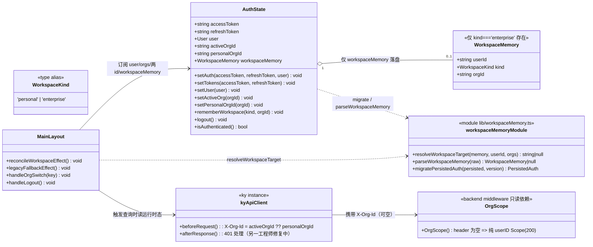
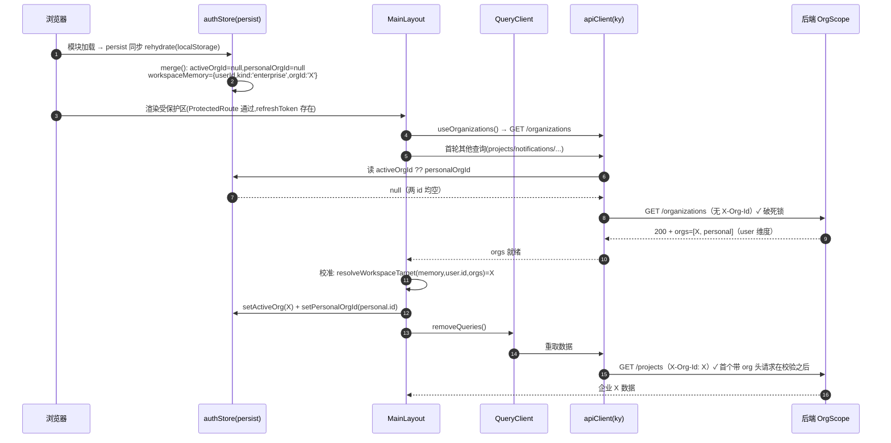
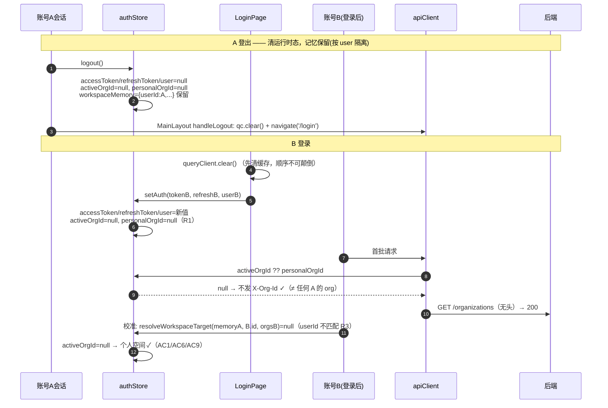
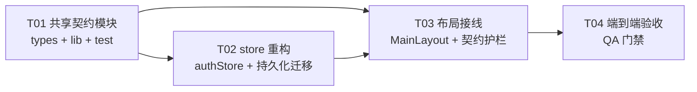

# 记住上次选中的空间（企业 / 个人）—— 系统设计与任务分解

- **文档类型**：系统架构设计 + 任务分解（Architect 交付）
- **日期**：2026-09-16
- **作者**：高见远（Architect / software-architect-2）
- **上游输入**：PRD《remember_last_workspace》（许清楚）+ 独立 QA 对抗评审《authstore-logout-orgid-review-2026-09-16.md》+ 主理人补充硬约束
- **范围**：**纯前端**（`frontend-v2`），**后端零改动**，**零新增依赖**
- **相关既有契约**：`docs/multi-tenant-enterprise-plan.md` §4.4 / §阶段 4；`authStore.test.ts:27-45`；`client.test.ts`；`tenant-isolation.test.ts`

> 本设计文档是唯一产出物（按主理人约束，不额外写 `docs/sequence-diagram.mermaid` / `docs/class-diagram.mermaid`，两份图内嵌于本文）。**本阶段不写任何实现代码、不改任何源码。**

---

## 0. 结论速览

| 项 | 结论 |
|---|---|
| 对 PM「记忆与运行时权威态分离」建议的评判 | ✅ **采纳，并做一处强化**（把「运行时态不进持久化」用 `persist.merge` 硬编码为不变量，且**主动迁移/剥离存量脏值**）。 |
| 核心破局点 | 把「记忆」与「运行时权威租户态」彻底分离；**运行时 `activeOrgId`/`personalOrgId` 永不从持久化恢复**（恢复前恒为 `null`），一切带 org 头的请求天然只可能出现在「本账号已校验」之后。 |
| 顺序死锁 | 无头 `GET /organizations` 先行（校验请求不带被校验的 org id）→ 从根上破除。已用 `org_scope.go` 活代码确证「空 header = 纯 user 维度」。 |
| 存量脏数据 | 用 `version:1 + migrate + merge` 三件套**主动剥离**旧 `activeOrgId`/`personalOrgId`，并（推荐）合成按用户维度的记忆以保留一次体验。 |
| `client.ts` | **不改**（请求头仍 `activeOrgId ?? personalOrgId`），与另一位工程师的 401 循环修复**零写冲突**。 |
| 风险等级 | 中（触达请求头信任边界，但靠「运行时态恒空 + 唯一写点 + 校验后写」三重锁死）。 |
| 任务数 | **4 个**（3 个构建任务 + 1 个 QA 验收门禁），全部有明确验收方式。 |

---

# Part A — 系统设计

## 1. 实现方案与技术选型

### 1.1 核心难点分析

1. **安全难点（跨账号串租户）**：根因不是「记住」需求本身，而是**把未校验的持久化 id 直接当请求头用**（`client.ts:61` `activeOrgId ?? personalOrgId`）。存量实现里这两个字段被 `partialize` 白名单持久化（`authStore.ts:44-45`），刷新/冷启动会 rehydrate 回内存，换账号时被继承 → B 的请求带 A 的 org id → 后端 401。
2. **顺序死锁难点**：回落 effect（`MainLayout.tsx:127-133`）要求 `orgs` 先就绪，而 `orgs` 来自 `GET /organizations`，该请求自身会带上同一条陈旧头 → 401 → `orgs` 永远 `undefined` → 回落短路、水合（`:141-147`）一并死锁。
3. **存量数据迁移难点**：把两个字段移出 `partialize` **不会删除已写入 localStorage（key `trustmesh-v2:auth`）的旧值**；当前 store **没有** `version` / `migrate`（已核）。必须显式迁移，否则新版本首帧仍会把旧值当运行时态用出去。
4. **时序难点（冷启动 rehydrate）**：zustand `persist` 对同步 storage（`localStorage`）是**同步 rehydrate**——在 React 首帧之前就把旧值写回内存态。这是最容易漏的点。

### 1.2 技术选型与方案

沿用现有栈，**无新增框架/依赖**：`zustand` + `zustand/middleware persist`、`TanStack Query`、`ky`、`vitest@5 + jsdom@30`（无 `@testing-library`）。

**核心方案：记忆与运行时权威态分离（采纳 PM 建议 + 强化）**

| 概念 | 归属 | 是否持久化 | 语义 |
|---|---|---|---|
| `activeOrgId` | **运行时权威态** | ❌ 否 | 当前会话已校验的活跃企业租户；`null` = 个人空间 |
| `personalOrgId` | **运行时权威态** | ❌ 否 | 本账号个人租户 id，由本账号 `orgs` 水合 |
| `workspaceMemory` | **记忆（提示数据）** | ✅ 是（按 user 维度） | `{ userId, kind:'personal'\|'enterprise', orgId? }`，仅在**校验通过**后才被采用 |
| `refreshToken` / `user` | 会话凭证 | ✅ 是 | 维持现状 |

**三条不变量（Invariant，照做即对）**

- **INV-1（运行时态不进持久化）**：`partialize` 只输出 `{refreshToken, user, workspaceMemory}`；且 `persist.merge` **无条件**把 `activeOrgId`/`personalOrgId` 置 `null`。→ 任何来源（含手工改 localStorage、旧版本残留）都无法让运行时态在恢复前非空。**这是 R1/R2/R4 的根。**
- **INV-2（唯一写点 + 写前必校验）**：运行时 `activeOrgId` 仅由四处写入：① `setAuth` → `null`；② 校准 effect → **经 `resolveWorkspaceTarget` 校验后的值**；③ `handleOrgSwitch` → **经 `orgs.some(id===key)` 校验后的值**；④ **防御性回落 effect（保留的既有 effect）→ 仅 `null`**，触发条件为 `activeOrgId ∉ orgs`。`personalOrgId` 仅由 ① `setAuth`/`logout` → `null`；② 校准 effect → **来自本账号 `orgs` 的 `kind==='personal'` 项**。→ 「写入值」只有两种：`null`，或经校验的值；无任何路径可写入未校验 id。

  > 📌 2026-09-16 T03 复核补正：本项原写「**三处**」，遗漏了第 ④ 处（`MainLayout.tsx` 防御性回落 effect，`setActiveOrg(null)`）。该处**只写 `null`**，故安全结论不变，但枚举必须完整 —— 这是安全审计会逐条核对的声明，数字写错会让后来人误判「自己漏了什么」。代码中该写点见 `layouts/MainLayout.tsx:137-143`（注释已标明为「防御」）。
- **INV-3（校验请求不带被校验头）**：`GET /organizations` 必然发生在两 id 均为 `null` 的时刻（首帧 → 首轮查询全部无 org 头），故校验请求天然「干净」。→ 破顺序死锁。

**对 PM 建议的评判：采纳 + 1 处强化**
- ✅ 采纳「持久化只存按 user 维度的记忆、运行时态由校验结果写入」——方向正确，能同时满足 R1/R2/R3/R5 且让既有红测试转绿。
- ➕ 强化 1：PM 只说「不进 partialize」，但**存量 localStorage 仍有旧值**。本设计新增 `version:1 + migrate + merge` 三件套**主动剥离**（PM 未覆盖，主理人硬约束 #2）。
- ➕ 强化 2：把「运行时态恒空」从「约定」升级为**代码级不变量**（`merge` 硬编码 null），即使未来 rehydrate 时序变化也不破。
- ➕ 强化 3：`rememberWorkspace` 写入**带上 `user.id`**，读取时用 `memory.userId === currentUser.id` 守门 —— 落实 R3 到「存储层就隔离」。

### 1.3 架构模式

沿用既有分层：`store（authStore）` 持状态 → `lib（纯函数）` 持可测决策逻辑 → `layout（MainLayout）` 持生命周期/编排 → `api（client）` 只读运行时态注入头。**决策逻辑抽成纯函数**，以适配「无 `@testing-library`」的测试环境（单测纯函数 + 源码级契约断言）。

---

## 2. 文件列表（相对路径）

| # | 文件 | 性质 | 说明 |
|---|---|---|---|
| 1 | `frontend-v2/src/types/index.ts` | 修改（新增类型） | 新增 `WorkspaceKind`、`WorkspaceMemory` 导出（单一类型源）。 |
| 2 | `frontend-v2/src/lib/workspaceMemory.ts` | **新增** | 纯函数模块：`resolveWorkspaceTarget` / `parseWorkspaceMemory` / `migratePersistedAuth`。可独立单测。 |
| 3 | `frontend-v2/src/lib/workspaceMemory.test.ts` | **新增** | 纯函数单测（覆盖 R3/R10、AC4/AC6）。 |
| 4 | `frontend-v2/src/stores/authStore.ts` | 修改（**核心**） | 新增 `workspaceMemory` 态与 `rememberWorkspace` action；`setAuth` 复位两 id；`logout` 恢复清空两 id；`partialize` 改写；新增 `version:1 + migrate + merge`。**取代工作树中未提交的 logout 改动。** |
| 5 | `frontend-v2/src/stores/authStore.test.ts` | 修改（扩充） | 既有 `:27-45` 转绿；新增 AC1/AC2/R3 断言。 |
| 6 | `frontend-v2/src/stores/authStore.persist.test.ts` | **新增** | 持久化 / 迁移 / merge 集成测试（mock localStorage + 重导入）。 |
| 7 | `frontend-v2/src/layouts/MainLayout.tsx` | 修改 | 用「统一工作区校准 effect」替换原个人租户水合 effect；`handleOrgSwitch` 增加 `rememberWorkspace`；保留登出与回落防御 effect。 |
| 8 | `frontend-v2/src/__tests__/tenant-isolation.test.ts` | 修改（扩充） | 追加源码级契约断言（partialize 不含两 id、校准 effect、记忆写入点）。 |
| 9 | `frontend-v2/src/api/client.test.ts` | 修改（扩充） | 追加 AC1/AC5 头断言（换账号后首个请求无 org 头）。 |
| 10 | `docs/remember-last-workspace-verification-2026-09-16.md` | **新增**（QA 产出） | 验收记录（T04）。 |

> **不改** `frontend-v2/src/api/client.ts`、`assistant.ts`、后端任何文件（见硬约束应答 §附-4）。

---

## 3. 数据结构与接口

### 3.1 类图（Mermaid classDiagram）



**接口签名（可直接照抄）**

```ts
// types/index.ts 新增
export type WorkspaceKind = 'personal' | 'enterprise'
export interface WorkspaceMemory {
  userId: string
  kind: WorkspaceKind
  /** 仅 kind === 'enterprise' 时存在；kind === 'personal' 时 undefined */
  orgId?: string
}

// me
// lib/workspaceMemory.ts 新增
export function resolveWorkspaceTarget(
  memory: WorkspaceMemory | null | undefined,
  currentUserId: string | null | undefined,
  orgs: ReadonlyArray<{ id: string; kind: 'personal' | 'enterprise' }> | null | undefined,
): string | null

export function parseWorkspaceMemory(raw: unknown): WorkspaceMemory | null

export interface PersistedAuthV1 {
  refreshToken: string | null
  user: unknown
  workspaceMemory: WorkspaceMemory | null
}
export function migratePersistedAuth(persisted: unknown, version: number): PersistedAuthV1

// authStore.ts —— AuthState 新增一项 + 一个 action
//   workspaceMemory: WorkspaceMemory | null
//   rememberWorkspace: (kind: WorkspaceKind, orgId?: string | null) => void
```

### 3.2 存储 key 与 schema

| 项 | 值 |
|---|---|
| storage key | `trustmesh-v2:auth`（**不变**） |
| 存储介质 | `localStorage`（zustand persist 默认 `createJSONStorage`） |
| 版本 | 隐式 `0`（现状）→ **显式 `1`** |
| v1 persisted schema | `{ state: { refreshToken, user, workspaceMemory }, version: 1 }` |
| v0 legacy schema（存量） | `{ state: { refreshToken, user, activeOrgId, personalOrgId }, version: 0 }` |

### 3.3 关键实现约定（照做即对）

**（a）纯函数决策逻辑——`lib/workspaceMemory.ts`**

```ts
export function resolveWorkspaceTarget(memory, currentUserId, orgs) {
  if (!memory || !currentUserId) return null
  if (memory.userId !== currentUserId) return null          // R3：不读他人记忆
  if (memory.kind !== 'enterprise') return null             // personal → 个人空间(null)
  if (!memory.orgId) return null
  if (!orgs) return null
  // R5：企业 org 必须 ∈ 本账号 orgs 且确为企业租户
  return orgs.some((o) => o.id === memory.orgId && o.kind === 'enterprise')
    ? memory.orgId
    : null
}

export function parseWorkspaceMemory(raw) {
  if (!raw || typeof raw !== 'object') return null
  const m = raw as Record<string, unknown>
  if (typeof m.userId !== 'string' || !m.userId) return null
  if (m.kind !== 'personal' && m.kind !== 'enterprise') return null
  if (m.kind === 'enterprise') {
    if (typeof m.orgId !== 'string' || !m.orgId) return null
    return { userId: m.userId, kind: 'enterprise', orgId: m.orgId }
  }
  return { userId: m.userId, kind: 'personal' }
}

// 必须 total：任何输入都不抛（R10）
export function migratePersistedAuth(persisted, _version) {
  try {
    const s = (persisted ?? {}) as Record<string, unknown>
    const user = (s.user ?? null) as { id?: unknown } | null
    const refreshToken = typeof s.refreshToken === 'string' ? s.refreshToken : null
    let workspaceMemory = null
    const uid = user && typeof user === 'object' && typeof user.id === 'string' ? user.id : null
    if (uid) {
      if (typeof s.activeOrgId === 'string' && s.activeOrgId) {
        workspaceMemory = { userId: uid, kind: 'enterprise', orgId: s.activeOrgId }
      } else if (typeof s.personalOrgId === 'string' && s.personalOrgId) {
        workspaceMemory = { userId: uid, kind: 'personal' }
      }
    }
    // 关键：返回体【不含】activeOrgId / personalOrgId —— 结构性剥离
    return { refreshToken, user, workspaceMemory }
  } catch {
    return { refreshToken: null, user: null, workspaceMemory: null }
  }
}
```

**（b）store 层——`stores/authStore.ts`**

- `setAuth`：`set({ accessToken, refreshToken, user, activeOrgId: null, personalOrgId: null })`（R1）。
- `logout`：`set({ accessToken: null, refreshToken: null, user: null, activeOrgId: null, personalOrgId: null })`（R2，`workspaceMemory` **刻意保留**）。
- `rememberWorkspace(kind, orgId)`：`const uid = get().user?.id; if (!uid) return; if (kind === 'enterprise') { if (!orgId) return; set({ workspaceMemory: { userId: uid, kind, orgId } }) } else { set({ workspaceMemory: { userId: uid, kind: 'personal' } }) }`。
- `persist` 配置：

```ts
{
  name: 'trustmesh-v2:auth',
  version: 1,
  partialize: (s) => ({ refreshToken: s.refreshToken, user: s.user, workspaceMemory: s.workspaceMemory }),
  migrate: (persisted, version) => migratePersistedAuth(persisted, version),
  merge: (persisted, current) => {
    const p = (persisted ?? {}) as Partial<AuthState>
    return {
      ...current,                                   // 保留 actions 与内存初值
      refreshToken: p.refreshToken ?? null,
      user: p.user ?? null,
      workspaceMemory: parseWorkspaceMemory(p.workspaceMemory),
      activeOrgId: null,                            // INV-1：运行时态永不从持久化恢复
      personalOrgId: null,
    }
  },
}
```

**（c）校准 effect——`layouts/MainLayout.tsx`**（替换现有 `:141-147` 水合 effect）

```ts
const personalOrg = useMemo(() => (orgs ?? []).find((o) => o.kind === 'personal') ?? null, [orgs])

// 统一工作区校准：orgs 就绪后一次决定 (a) 个人租户 id 水合 (b) 依记忆恢复企业空间
useEffect(() => {
  if (!user || !orgs) return
  const nextPersonal = personalOrg?.id ?? null
  const nextActive = resolveWorkspaceTarget(workspaceMemory, user.id, orgs)
  const personalChanged = nextPersonal !== personalOrgId
  const activeChanged = nextActive !== activeOrgId
  if (!personalChanged && !activeChanged) return
  if (personalChanged) setPersonalOrgId(nextPersonal)   // 与下一行同步写入（同一 tick）
  if (activeChanged) setActiveOrg(nextActive)
  qc.removeQueries()                                     // 校准后再重取（唯一一次重取触发点）
}, [user, orgs, personalOrg, workspaceMemory, activeOrgId, personalOrgId, qc, setActiveOrg, setPersonalOrgId])
```

- `handleOrgSwitch`：个人分支在 `setActiveOrg(null)` 后加 `rememberWorkspace('personal')`；企业分支在 `setActiveOrg(key)` 后加 `rememberWorkspace('enterprise', key)`；两者仍保留 `window.location.reload()`。
- **保留**原回落防御 effect（`:127-133`）——见 §5 说明其为何不再是主路径但仍保留。

---

## 4. 程序调用流程

### 4.1 冷启动 / 整页刷新（记忆=企业 X）—— 破顺序死锁的最关键路径



**判定分支（照做即对）**

1. 首帧两 id 恒为 `null`（INV-1）→ 首轮**所有**请求无 `X-Org-Id` → 后端 `org_scope.go:25-35` 空 header 分支 = 纯 `UserID` Scope → `GET /organizations` 200。**顺序死锁不成立。**
2. `orgs` 就绪 → 校准：
   - 记忆=enterprise 且 `orgId ∈ orgs`（且 `kind==='enterprise'`）→ `setActiveOrg(X)`（**正向恢复 R8/AC7**）。
   - 记忆=personal / 无记忆 / `orgId ∉ orgs` / 记忆 `userId≠当前` → `resolveWorkspaceTarget` 返回 `null` → `setActiveOrg(null)`（**安全回落 R6/AC4/AC6**）。
3. `removeQueries()` → 按新空间重取（**切空间一致 AC8**）。

> **关键时序保证**：两 id 的写入在同一 effect 内同步完成，且**只有** `removeQueries()` 会触发重取（`setActiveOrg`/`setPersonalOrgId` 不改变任何 queryKey）→ 重取时读到的一定是**最终**（已校验）的运行时态，不存在「先发个人头、后发企业头」的中间窗口。

### 4.2 登录 / 换账号



### 4.3 登出

1. `MainLayout.handleLogout()` → `logout()`（清 token/user + 两 id；**保留** `workspaceMemory`）→ `qc.clear()` → `navigate('/login')`。
2. 记忆对未来登录者不可见（读取时 `userId` 守门）。

### 4.4 切换空间

1. `handleOrgSwitch(key)`：
   - `key === '__personal__'` 且 `activeOrgId` 非空 → `setActiveOrg(null)` + `rememberWorkspace('personal')` + `reload()`。
   - 企业分支：`orgs.some(id===key)` 且 `key !== activeOrgId` → `setActiveOrg(key)` + `rememberWorkspace('enterprise', key)` + `reload()`。
2. `persist` 在 `set` 时同步写盘 → **记忆先于 reload 落盘**。
3. reload 后回到 §4.1 流程复现同一空间（**AC8**）。

### 4.5 记忆失效（被移出企业 / 企业被删 / 记忆损坏）

1. 记忆存在但 `orgId ∉ orgs`（`resolveWorkspaceTarget` → `null`）→ `setActiveOrg(null)` → 个人空间。**不弹窗、不报错、不白屏**（R6）。
2. 记忆 JSON 损坏 / 结构非法（`parseWorkspaceMemory` → `null`）→ 视为无记忆 → 个人空间（R10）。
3. `migrate` 抛错 → 被 `try/catch` 兜住返回全空 → 个人空间（R10）。
4. 全程**零 401**：校验用的 `GET /organizations` 无 org 头；其后的重取带的是**已校验**的值（AC5）。

---

## 5. 关于「保留回落防御 effect」的说明

`MainLayout.tsx:127-133` 的旧回落 effect（`activeOrgId && orgs && !orgs.some(...)` → 清空）在新设计下**不再是主路径**（因为 `activeOrgId` 只会被写入已校验值），但**建议保留**：

1. 作为「`orgs` 二次刷新后目标失效」的兜底（例如 `orgs` 被 `invalidateQueries` 后某项消失）。
2. 满足既有源码级契约 `tenant-isolation.test.ts` 对 `removeQueries` 出现次数 ≥2 的断言（保留后 MainLayout 恰有 2 处 `qc.removeQueries()`，与原状一致，测试不受影响）。

两 effect 均幂等：校准后再次运行 `changed=false` 直接 return；即便偶发双调用 `removeQueries()` 也无副作用（仅失效缓存）。**不会死循环。**

---

# Part B — 任务分解

## 6. 依赖包列表

**零新增依赖。** 全部复用既有：`zustand`（含 `persist` 中间件）、`@tanstack/react-query`、`ky`、`vitest@5`、`jsdom@30`。

> 不引入 `@testing-library/*`：本仓库测试策略为「纯函数单测 + 源码级契约断言」，保持与 `vitest.config.ts` 一致。

---

## 7. 任务列表（按依赖顺序）

> **硬性约束对齐**：任务数 = 4（≤5）；T01–T03 每个 ≥3 个文件；T01 为「无依赖的共享契约基础设施」；T04 为 QA 验收门禁。

### T01 · 共享契约模块（纯函数 + 类型） — P0

- **源文件**：
  - `frontend-v2/src/types/index.ts`（新增 `WorkspaceKind`/`WorkspaceMemory`）
  - `frontend-v2/src/lib/workspaceMemory.ts`（新增：3 个纯函数）
  - `frontend-v2/src/lib/workspaceMemory.test.ts`（新增）
- **依赖**：无
- **内容**：实现 §3.3(a) 的三个纯函数；`resolveWorkspaceTarget` 严格落实 R3（userId 守门）与 R5（org 校验）；`migratePersistedAuth` 必须 total（不抛）并按 §3.2 结构性剥离旧字段。
- **验收方式**：
  - `npx vitest run src/lib/workspaceMemory.test.ts` 全绿（覆盖 AC6、AC4 内核、R10 损坏降级）；
  - `npx tsc --noEmit` 无新增错误。

### T02 · store 层重构（记忆与运行时态分离 + 持久化迁移） — P0

- **源文件**：
  - `frontend-v2/src/stores/authStore.ts`（**取代工作树未提交改动**）
  - `frontend-v2/src/stores/authStore.test.ts`（扩充）
  - `frontend-v2/src/stores/authStore.persist.test.ts`（新增）
- **依赖**：T01
- **内容**：按 §3.3(b) 落地——新增 `workspaceMemory` + `rememberWorkspace`；`setAuth` 复位两 id；`logout` 清两 id；`partialize` 改写；`version:1 + migrate + merge`。
- **验收方式**：
  - **`authStore.test.ts:27-45` 必须转绿（AC2）**；
  - 新增：A 会话 → `logout()` → 模拟 B `setAuth` → 断言两 id 为 `null`（AC1）；
  - `rememberWorkspace` 写 `userId`；`authStore.persist.test.ts` 用 mock localStorage 注入 **v0 旧结构** → 断言 rehydrate 后 `activeOrgId`/`personalOrgId` 为 `null` 且 `workspaceMemory` 正确合成（R1/R2/R3 + 迁移）；
  - `npx vitest run src/stores` 全绿。

### T03 · 布局接线 + 跨文件契约护栏 — P0

- **源文件**：
  - `frontend-v2/src/layouts/MainLayout.tsx`（校准 effect + `rememberWorkspace`）
  - `frontend-v2/src/__tests__/tenant-isolation.test.ts`（扩充源码级断言）
  - `frontend-v2/src/api/client.test.ts`（扩充 AC1/AC5 头断言）
- **依赖**：T01、T02
- **内容**：按 §3.3(c) 用统一校准 effect 替换原水合 effect；`handleOrgSwitch` 两分支补 `rememberWorkspace`；保留登出与回落 effect。
- **验收方式**：
  - `tenant-isolation.test.ts`、`client.test.ts` 全绿（含新增：断言 `partialize` 不含两 id、MainLayout 存在 `rememberWorkspace(`/校准 effect、`removeQueries` ≥2）；
  - 新增头断言：登出 → 新登录后首个请求 `x-org-id === undefined`（AC1/AC5）。

### T04 · 端到端验收与回归（QA 门禁） — P0

- **源文件**：`docs/remember-last-workspace-verification-2026-09-16.md`（新增，QA 产出）；**无源码改动**
- **依赖**：T03
- **内容**：跑全套测试 + AC1–AC9 逐条走查（含手动：单浏览器连续登录、切空间后刷新、被移出企业后重登）。
- **验收方式**：`npx vitest run` 全套绿；`npx tsc --noEmit` + `eslint` 无新增告警；AC1–AC9 全通过并记入报告；确认无 401 风暴（`/organizations` 200）。
- **说明（对「每任务 ≥3 文件」的合理偏离）**：T04 是**验收门禁**而非构建任务，其交付物是「一套全绿测试 + 一份验收报告」；真正的 ≥3 文件构建职责由 T01–T03 承担。

---

## 8. 共享知识（跨文件约定）

1. **命名**：持久化记忆一律叫 `workspaceMemory`；运行时权威态一律叫 `activeOrgId` / `personalOrgId`（**禁止**持久化）。类型名 `WorkspaceMemory` / `WorkspaceKind`。
2. **存储 key**：`trustmesh-v2:auth` **不变**；显式 `version: 1`。
3. **请求头来源**：保持 `const orgId = activeOrgId ?? personalOrgId`（`client.ts:61`）——**本设计不触碰 `client.ts`**。
4. **错误处理约定**：`migrate` / `parseWorkspaceMemory` 必须 **total（绝不抛）**；一切损坏 → `null` → 静默个人空间；**禁止**在记忆失效路径上弹窗/报错。
5. **唯一写点（INV-2）**：`activeOrgId` 只由 `setAuth`(=null) / 校准 effect(=已校验) / `handleOrgSwitch`(=已校验) / **防御性回落 effect(=null，仅当 `activeOrgId ∉ orgs`)** 四处写入；`personalOrgId` 只由 `setAuth|logout`(=null) / 校准 effect(=本账号 orgs) 写入。**写入值只有 `null` 或已校验值两种；新增任何 org id 写点都必须先过校验。**
6. **联动**：切空间仍走 `window.location.reload()`（不变）；恢复走原地 `setActiveOrg` + `removeQueries`（不整页刷新）。
7. **测试放置与命名**：
   - 纯函数 → `src/lib/*.test.ts`；
   - store → `src/stores/*.test.ts`；
   - 源码级/行为契约 → `src/__tests__/*.test.ts`；
   - **禁止引入 `@testing-library/*`**。
8. **迁移方向**：v0（隐式）→ v1（显式）。v1 结构**绝不**包含 `activeOrgId`/`personalOrgId`。

---

## 9. 任务依赖图



---

## 10. 待明确事项（需甲方拍板，≤3）

1. **存量迁移是否「合成」记忆**：本设计**推荐**从旧 `activeOrgId`/`personalOrgId` 合成 `workspaceMemory`（安全：仍经 `userId` 守门 + `orgs` 校验），使存量用户升级后**保留一次**「上次空间」体验。若甲方偏好「升级即从零」，则 `migrate` 改为直接返回 `workspaceMemory: null`（更简单，但用户会丢失一次记忆）。
2. **~~首屏额外一轮请求~~ → ⚠️ 经 T04 对抗验收升级为「无头窗口」风险（P2，**需重新拍板**）**

   **原表述只算了「多一轮请求」，低估了。** T04 实证（`software-qa-engineer-4`，2026-09-16）：`MainLayout` **无 orgs 就绪门控** —— `<Outlet/>` 与侧边栏「最近项目」挂载即渲染，`useUnreadCount/useProjects/useExternalApps/useOrganizations` 同帧触发。

   - **改造前**：`activeOrgId` 是**持久化**的 ⇒ 刷新后首帧即带企业头，无闪变。
   - **改造后**：恢复前恒为 `null` ⇒ **首轮全部无头**，后端按 **user 维度**返回。两重后果：
     1. **闪变**：先渲染 user 维度（**该用户跨其全部工作区的自有项目**）→ `removeQueries()` 后切企业维度。窗口 = `GET /organizations` 一次往返（正常 ms 级，慢网可达秒级）。
     2. **误写窗口**：`backend/internal/store/scope.go:61-66` 的 `resolveOwnerOrgUnsafe` 在**无头**时把**新建资源挂到用户个人租户** ⇒ 窗口内若发生写操作，会误挂到**个人 org** 而非记忆中的企业 X。**这才是真正的正确性问题**（不只是观感）。
   - ✅ **不含跨用户数据泄露**：无头 → `store.Scope{UserID}` → `projectVisible` 走 `ownedByUser`（`backend/internal/store/scope.go:106-107`），只返回该用户自己拥有的数据。
   - ⚠️ **性质**：这是**相对改造前的行为回归** —— 刷新路径上从「首帧带（正确）租户头、无闪变」变为「首轮无头、有闪变 + 亚秒误写窗口」。**这是为修掉跨账号继承而付出的可接受但非零的代价**，代价本身比原文档描述的大。
   - **缓解方案（若甲方要求消除）**：对受保护区加 gate —— `orgs`/校准就绪前渲染骨架（skeleton），或给数据 hooks 加 `enabled: workspaceCalibrated`。可**同时**消除闪变与误写面；代价是首屏多一个骨架态。
   - **当前状态**：⏳ 待甲方拍板（T04 报告 **F2**）。**此项不得在未拍板前被当作「已接受」引用。**
3. **记忆管理开关（R11，P2）**：本批是否纳入 UI 开关？**推荐本批不做**（聚焦 P0 安全与 P1 恢复，保持最小面）。

---

## 附：对主理人 5 条硬约束的逐条应答

1. **顺序死锁（已确证破掉）**：后端 `org_scope.go:25-35`——`X-Org-Id` 为空时**只注入 `store.Scope{UserID}`**（注释明确「与改造前完全一致」），故无头 `GET /organizations` 走 user 维度、返回 200。前端保证首次 `/organizations` 发生在两 id 均为 `null` 的时刻，**包括冷启动 rehydrate 之后**：因为 `persist.merge` **无条件**把两 id 置 `null`，不依赖 `rehydrate` 的同步/异步时序（即使 rehydrate 先于渲染完成，运行态仍是 `null`）。→ INV-1 + INV-3。
2. **存量数据迁移/清理（已设计）**：现状 **无 `version`/`migrate`**；本设计新增 `version:1 + migrate`（结构性剥离旧字段、可合成记忆）**+ **`merge`（无条件把两 id 置 `null`，即便旧数据残留或被人为篡改也无法污染运行态）。迁移失败/JSON 损坏 → `try/catch` + zustand 解析兜底 → 全空 → 个人空间。**杜绝「旧值班客户端写入的脏值在新版本首帧被当运行时态用出去」。**
3. **`activeOrgId` 恢复前必须为 null（阻断层已指明）**：**store 层（`persist.merge`）** 硬阻断——运行时态来源与持久化彻底解耦；上层唯一写点见 INV-2。`MainLayout` effect 与请求层都**不再是**「未校验值」的可能入口。
4. **`client.ts` 边界**：**本设计不改 `client.ts`**（`client.ts:61` 保持 `activeOrgId ?? personalOrgId`）。由于运行态只可能持有「已校验」值或 `null`，请求层无需改动即满足 R4。**与另一位工程师的 401 无界 refresh+重放修复零写冲突，无需串行化。**（补充：`api/assistant.ts:36` 同语义，同样不改。）
5. **可回退 / 可观测 / 首屏影响**：
   - **逃生路径**：清 `localStorage['trustmesh-v2:auth']` 或「登出 → 重登」→ 因运行态**从不持久化**，必然回到干净态（`isAuthenticated` 由 `refreshToken` 决定，登出即失效并跳 `/login`）。
   - **可观测**：`migrate` 命中/剥离均为纯函数、可单测；校准 decision 由纯函数 `resolveWorkspaceTarget` 决定，可单测复现。
   - **首屏延迟**：校准是**串行**的（`orgs` 就绪后一次 `removeQueries` 重取），不新增 loading 门控；代价是首屏多一轮数据请求（见待明确 #2）。现有 `Suspense`/查询 loading 态即可覆盖，无需白屏风险。

---

## 附：验收标准（AC）→ 实现点 → 测试 映射

| AC | 实现点 | 测试落点 |
|---|---|---|
| AC1 跨账号不继承 | `logout`/`setAuth` 清两 id + `merge` 置 null + 记忆 userId 守门 | `authStore.test.ts` 新增；`client.test.ts` 头断言 |
| AC2 登出清运行时 id | `logout` 恢复清空两 id | `authStore.test.ts:27-45` 转绿 |
| AC3 个人空间不带企业 id | 请求头仍 `activeOrgId ?? personalOrgId`（未改） | `client.test.ts:70-76` 保持 |
| AC4 失效空间安全回落（无死锁） | `resolveWorkspaceTarget` 返回 null；校验请求无 org 头 | `workspaceMemory.test.ts` + `tenant-isolation.test.ts` |
| AC5 无 401 风暴 | 首轮全无头 + 校验后重取 | `client.test.ts` 新增；T04 手动走查 |
| AC6 记忆按用户维度隔离 | `parseWorkspaceMemory` + `resolveWorkspaceTarget(userId)` | `workspaceMemory.test.ts`；`authStore.persist.test.ts` |
| AC7 刷新后正向恢复 | 校准 effect 采用校验后的企业 id | `tenant-isolation.test.ts` 源码级 + T04 手动 |
| AC8 与切空间交互一致 | `handleOrgSwitch` + `rememberWorkspace` + `reload` | `tenant-isolation.test.ts`；T04 手动 |
| AC9 登出后干净 | `setAuth`/`logout` 复位 + 记忆守门 | `authStore.test.ts` 新增 |

---

**设计完毕。** 工程师可直接按 T01→T02→T03 顺序实现，QA 按 T04 验收。
