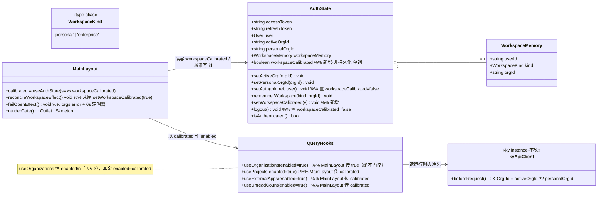

# 「记住上次选中的空间」· F2「无头窗口」门控（gate）—— 增量系统设计与任务分解

- **文档类型**：增量架构设计 + 任务分解（Architect 交付）
- **日期**：2026-09-16
- **作者**：高见远（Architect / software-architect-3）
- **上游输入**：
  1. 基线设计（**我方**此前交付）：`docs/remember-last-workspace-design-2026-09-16.md`（INV-1/2/3、任务分解 T01–T04）；
  2. T04 对抗验收报告 **F2「无头窗口」**（`software-qa-engineer-4`，2026-09-16）；
  3. 主理人拍板：**加 gate 消除 F2**（本设计即该 gate 的落地方案）。
- **基线提交**：T01 `6808b82`、T02 `811ff3f`、T03 `84240b7`（本设计要改的运行时基线）。
- **范围**：**纯前端**（`frontend-v2`），**后端零改动**，**零新增依赖**，**不碰 `src/api/`**。
- **本文档是唯一产出物**（按主理人约束）：**不写任何实现代码、不改任何源码、不提交、不部署、不连生产**。两份图（类图 / 时序图）内嵌于本文，不另建 `docs/*.mermaid`。

> **给工程师的一句话**：把「`orgs` 就绪 **且** 校准已把**最终运行时态**写进 store 之前，绝不渲染受保护区、绝不让受保护区发请求」实现为一个**单调、不可 flap 的 store 布尔量**，并给它加**超时/失败兜底**。门控**绝不能**把 `GET /organizations` 自己关掉。

---

## 0. 结论速览

| 项 | 结论 |
|---|---|
| 核心信号 | 新增**非持久化** store 布尔量 `workspaceCalibrated`；**只**由校准 effect 在写完最终运行时 id 之后置 `true`；**只**由 `setAuth` / `logout` 置 `false`；另由 fail-open 定时器/orgs 错误兜底置 `true`。 |
| 为什么不 flap | `removeQueries()` 导致 `orgs` 经历 `数据 → undefined → 数据` 时，**没有任何语句**会写 `workspaceCalibrated = false`（唯一写 `false` 的是 `setAuth`/`logout`，校准期不会触发）⇒ 该布尔量在会话内**单调** true，gate 不可能抖动。 |
| 门控范围 | **渲染门控**：`<Outlet/>`（换骨架）+ 侧栏「最近项目」+ AI 助手 FAB；**查询门控（`enabled`）**：`useProjects` / `useExternalApps` / `useUnreadCount`；**绝不门控**：`useOrganizations`（INV-3）+ `useRealtimeEvents`（SSE 只带 Authorization）。 |
| 仅渲染门控 vs 同时 `enabled` 门控 | **推荐「两者都做」**（混合）：渲染门控**必须**做（挡住页面 mount ⇒ 连页级查询、深链、交互都一并封死）；`enabled` 门控**补做**（`MainLayout` 自身那 3 个 hook 无法靠渲染挡，否则仍会发无头 GET）。成本：给 3 个 hook 各加一个可选 `enabled = true` 参数（向后兼容）。 |
| 误写面 | 门控后，窗口内**唯一**可交互的是「静态导航菜单 / 折叠钮 / 主题钮 / 用户下拉（登出可用、切空间为 no-op）」。**无任何写路径**（页面与 AI 助手均未挂载）。 |
| 深链风险 | `/projects/:id`（错写成 `/app/projects/:id`）该页 `useProject` **不会**无头发出——因 `<Outlet/>` 被门控，页面组件在校准前**根本不 mount**。 |
| 关键护栏 | **绝不门控 `GET /organizations`**，否则重现 INV-3 顺序死锁（白屏级卡死）。 |
| 既有测试 | **全部保持绿**（逐文件见 §6）；需**逐条**遵守「源码级断言」的文本/顺序约束，最脆弱的一条是校准 effect 的**书写顺序**。 |
| AC | AC1–AC9 **全部成立**；**新增 AC10**「门控期不渲染 user 维度数据、不可交互、`/organizations` 未被门控」。 |
| 任务数 | **3 个**（T-G1 门控信号 / T-G2 查询门控 / T-G3 布局接线与护栏）。 |
| 最脆弱一环 | 校准 effect 内**「先写 id，后置 `workspaceCalibrated=true`」的顺序**——写反会**静默**复现 F2，且**没有任何既有测试会失败**。 |

---

# Part A — 系统设计

## 1. 实现方案与技术选型（含对「仅渲染 vs 同时 enabled」的明确推荐）

### 1.1 问题重述（F2 的因果链，已由 T04 实证）

改造后（INV-1）`persist.merge` **无条件**把 `activeOrgId`/`personalOrgId` 置 `null`。于是冷启动到校准完成之间，两个运行时 org id 恒为 `null` ⇒ 请求头 `X-Org-Id = activeOrgId ?? personalOrgId` 为空 ⇒ **首轮所有受保护请求都无头**。而 `MainLayout` 当前**无任何就绪门控**：

- `<Outlet/>`（`layouts/MainLayout.tsx:534`）与侧栏「最近项目」（`:347-407`）**挂载即渲染**；
- `useUnreadCount/useProjects/useExternalApps/useOrganizations`（`:74-77`）**同帧触发**；
- 页面级查询（如 `/projects/:id` 的 `useProject`）随 `<Outlet/>` 一并 mount 即发。

两重后果：**① 闪变**（先渲染 user 维度数据，校准后 `removeQueries()` 重取切企业维度）；**② 误写窗口**（窗口内写操作被后端 `resolveOwnerOrgUnsafe`（`backend/internal/store/scope.go:61-66`）挂到**用户个人租户**）。**后端无跨用户泄露**（无头 → `Scope{UserID}` → `projectVisible` 走 `ownedByUser`，`scope.go:106-107`），故 F2 是**正确性/观感**问题，非安全泄露。

### 1.2 破局思路（本设计的唯一手法）

**在「受保护区」前加一道门：在 `orgs` 就绪且校准写入最终运行时态之前，既不渲染受保护区、也不让受保护区发请求。**

**为什么门控能同时消灭闪变与误写**：
- **消灭闪变**：受保护区的渲染被挡 ⇒ 无头轮次返回的 user 维度数据**没有机会上屏**。
- **消灭误写**：受保护区（页面 + AI 助手）未挂载 ⇒ 用户**无任何可点击/可输入**的写入口 ⇒ 窗口内不可能发生写。

**为什么门控能顺带修掉登录路径的老问题**：改造前 `activeOrgId` 持久化 ⇒ 刷新首帧即带企业头（无闪变）；但**登录路径**本来就存在同样的无头首轮（`logout` 清 id → `MainLayout` 挂载 → 无头首轮 → 水合 → 重取），只是此前无人门控。gate 对两条路径一视同仁 ⇒ **额外收益**。

### 1.3 技术选型（零新增依赖）

沿用既有栈：TypeScript + React 19 + zustand/persist + TanStack Query + ky + vitest@5/jsdom@30。
**无 `@testing-library`** ⇒ 本设计一切断言落在两层：**store 层行为测试** + **源码级 `?raw` 契约断言**（与仓库既有测试策略一致，见 `tenant-isolation.test.ts`）。**新增依赖数 = 0。**

### 1.4 架构模式：门控信号放「store」，门控动作放「layout」，门控开关放「hook 的 enabled 参数」

| 层 | 职责 | 放什么 |
|---|---|---|
| **store（`authStore.ts`）** | 持有单一真相源 | `workspaceCalibrated: boolean`（非持久化）、`setWorkspaceCalibrated(v)` |
| **layout（`MainLayout.tsx`）** | 生命周期：校准提交信号 + fail-open 兜底 + 决定渲染门控 | 校准 effect 末尾置 true；fail-open 定时器；`{calibrated ? <Outlet/> : <骨架/>}` |
| **hook（`useProjects` 等）** | 查询开关 | 可选 `enabled = true` 参数；调用点传 `calibrated` |

> **为什么信号放 store（而不是 `useMemo` / 局部 `useState`）**：
> 1. 它是「本账号会话是否已完成一次工作区校准」的**会话级事实**，语义上属 auth 域；
> 2. **可被 store 单测直接验证**（默认 false / 复位 / 不落盘），无需挂载组件（本仓无 RTL）；
> 3. 需同时被「渲染门控」与「3 个 hook 的 `enabled`」消费，放 store 是单一来源，避免两处各自推导。

### 1.5 🔴 门控信号的可判定定义（照做即对，不留「各自发挥」）

**信号**：`workspaceCalibrated: boolean`（存于 `authStore`，**非持久化**）。
**读取**：`const calibrated = useAuthStore((s) => s.workspaceCalibrated)`。

**它何时为 `false` / `true` —— 可判定的六条规则**：

| 规则 | 判定条件 | 结果 |
|---|---|---|
| **R-init** | store 初次创建（含整页 reload 后） | `workspaceCalibrated = false` |
| **R-persist** | `partialize` 输出对象 | **不含** `workspaceCalibrated`（⇒ 冷启动必为 false） |
| **R-commit** | 校准 effect 命中「`orgs` 已就绪」分支，且**已同步写完** `setPersonalOrgId(nextPersonal)` / `setActiveOrg(nextActive)`，并（若变更）已 `qc.removeQueries()` | 置 `true` |
| **R-monotonic** | 会话内除 `setAuth`/`logout` 之外**任何**代码路径 | **只可能写 `true`，绝不写 `false`** |
| **R-reset** | `setAuth(...)` 或 `logout()` | 置 `false` |
| **R-failopen** | (a) `orgs` 查询进入 error 态；(b) 挂载超时 `N` ms（默认 **6000ms**） | 置 `true`（兜底，只写 true） |

**门控谓词（唯一）**：`calibrated === true` ⇒ 放行受保护区；否则门控。

**「校准尚未发生」的可判定判据**：
- `GET /organizations` **返回之前**恒为 `false`（因为 `R-commit` 要求 `orgs` 已就绪，`R-init` 保证初值为 false，`R-monotonic` 保证不会提前被别的路径置 true）—— 门控有效；
- 在「`orgs` 就绪 **且** 校准 effect 已写入最终运行时态」之后为 `true` —— 恰好在不变量的安全点上开闸；
- 未登录时 `MainLayout` 根本不会被渲染（`ProtectedRoute` 无 `refreshToken` 即跳 `/login`），故 **登录页不受门控**；已登录但 `user` 缺失的畸形态由 **R-failopen** 兜底。

**「为什么不会 flapping」的机制性论证（关键）**：
1. `removeQueries()`（无参）会**连 `orgs` 查询一起移除并触发重取** ⇒ `orgs` 引用经历 `数据 → undefined → 数据`；
2. `orgs` 变 `undefined` 时，校准 effect 走 **早返回** `if (!orgs) return` —— 该分支**不写** `workspaceCalibrated`；
3. 全代码库**唯一**能把 `workspaceCalibrated` 写成 `false` 的地方是 `setAuth`/`logout`；二者在校准后的 `orgs` 重取期间**不会运行**；
4. 因此 `workspaceCalibrated` 一旦为 `true`，在本次会话内**单调保持 true**，与 `orgs` 的引用抖动**完全解耦** ⇒ **gate 不可能 flap**。
5. 再次运行校准 effect 时（`orgs` 回来后）：`nextPersonal === personalOrgId` 且 `nextActive === activeOrgId` ⇒ `changed = false` ⇒ 不再 `removeQueries`、不再改 id，仅幂等地再写一次 `true`（zustand 选择器 `Object.is` 相等 ⇒ 不触发重渲染）⇒ **收敛**。

> **明确否决「用 `orgs` 派生 gate」**：`const calibrated = !!orgs` 会在 `removeQueries` 触发的重取中 `true → false → true` 抖动 ⇒ UI 闪骨架。**必须用单调布尔量**。

### 1.6 门控范围逐项清单（🔴 逐条给判定，含理由）

| # | 对象 | 判定 | 理由 |
|---|---|---|---|
| 1 | `useOrganizations()`（`MainLayout:77`） | **绝不门控**（保持 `useOrganizations()` 无参调用） | **INV-3**：校验 org id 的请求必须**先发且无头**。门控它 ⇒ `orgs` 永不就绪 ⇒ `workspaceCalibrated` 永不 true ⇒ **白屏级死锁**。这是本设计的**第一红线**。 |
| 2 | `useProjects()`（`MainLayout:75`，侧栏「最近项目」数据源） | **门控查询**：`useProjects(calibrated)` | 该 hook 在 `MainLayout` 顶层，无法靠渲染挡住；不加 `enabled` 则仍发**无头 GET /projects**（user 维度）。 |
| 3 | `useExternalApps()`（`MainLayout:76`，侧栏平台菜单数据源） | **门控查询**：`useExternalApps(calibrated)` | 同上；无头会拉来 user 维度外部应用并短暂进入侧栏菜单。 |
| 4 | `useUnreadCount()`（`MainLayout:74`，铃铛角标） | **门控查询**：`useUnreadCount(calibrated)` | 无头读取本身无害，但会污染 `notifications/unread-count` 缓存并被 `removeQueries` 立刻丢弃（纯浪费）；门控后与本轮语义一致。*（若甲方偏好「角标尽早出现」，可降级为「不门控」——见 §8 待明确）* |
| 5 | `<Outlet/>`（`MainLayout:534`，受保护页面） | **门控渲染**：`calibrated ? <Outlet/> : <骨架/>` | **最关键**：挡住页面 mount ⇒ ① 页级查询（`useProject`/`useTasks`/`useAgents`）不发；② 深链直达不 mount；③ 页面内所有写操作不可达。 |
| 6 | 侧栏「最近项目」区块（`MainLayout:347-407`） | **门控渲染**：仅 `calibrated && recentProjects.length > 0` 时渲染 | 它直接渲染 `projects`（user 维度）⇒ 不门控必闪变。 |
| 7 | `AssistantFab`（AI 助手，`MainLayout:538`） | **门控渲染**：`calibrated && <AssistantFab/>` | **键盘快捷键（Ctrl+K）+ 发送**可在窗口内触发助手请求，助手工具可能**建资源** ⇒ 无头误写。必须封死。 |
| 8 | `useRealtimeEvents()`（SSE，`MainLayout:90`） | **绝不门控** | SSE 只带 `Authorization`，**不带 `X-Org-Id`**，不构成 F2；且它不写业务数据。 |
| 9 | 侧栏**静态导航菜单** `menuItems`（`:338-345`） | **不门控**（可显示；可按需 `disabled`） | 点击仅 `navigate`；`<Outlet/>` 已门控 ⇒ 目标页不 mount ⇒ 无写、无请求。 |
| 10 | 用户下拉（登出 / 切空间 / 管理 / 个人信息） | **不门控** | **登出是逃生路径**，必须可达；切空间在校准前 `orgs` 为空 ⇒ `handleOrgSwitch` 自动 no-op；其余项仅 navigate（页面被门控）。 |
| 11 | 折叠钮 / 主题钮（`:491-520`） | **不门控** | 纯本地 UI 状态，无 API。 |
| 12 | 侧栏「工作区名」（`activeWorkspaceName`） | **门控为中性占位** | 校准期 `orgs` 未就绪 ⇒ 当前表达式落到 `'个人空间'` 兜底会**短暂显示错误工作区名**。改为 `orgs ? activeWorkspaceName : '工作区'`（或骨架）。**注意**：校准后 `removeQueries` 会让 `orgs` 再短暂变 `undefined`，故该保护应绑 `orgs` 而非 `calibrated`。 |

### 1.7 「仅门控渲染」vs「同时 `enabled` 门控查询」——代价/收益对比与推荐

| 维度 | 仅门控渲染 | 同时 `enabled` 门控查询（推荐） |
|---|---|---|
| 消除闪变（#5/#6） | ✅（渲染被挡） | ✅ |
| 消除误写（#5/#7） | ✅（交互被挡） | ✅ |
| 消除**无头数据请求** | ❌ `MainLayout` 顶层 3 个 hook 仍发无头 GET（`#2/#3/#4`） | ✅ 无头请求仅剩 `GET /organizations`（INV-3 必需的那一次） |
| 无头数据进入 Query 缓存 | ⚠️ 会短暂进入，随后被 `removeQueries` 丢弃 | ✅ 不进入 |
| 代码成本 | 低（只改 `MainLayout` 渲染） | 中（3 个 hook 各加可选 `enabled`；调用点传参） |
| 破坏既有调用点 | 无 | 无（`enabled = true` 默认值，`CreateTaskModal`/`useOfficeData`/`ExternalAppsPage` 等既有调用**零改动**） |
| 对 AC5（无 401 风暴） | 有帮助（请求更少） | 帮助最大（无头请求最少） |

> **推荐：两者都做（混合）。** 渲染门控**不可省**（它是封死深链、页级查询与交互的唯一手段）；`enabled` 门控是对 `MainLayout` 自身那 3 个「渲染门控够不着」的 hook 的**必要补充**，用于把「无头请求面」压到最小（仅剩 INV-3 必需的那一次 `/organizations`）。纯渲染方案虽也能满足 AC10 的「不渲染 / 不可交互」，但会**多发 3 条无头 GET**，与 F2「消除无头窗口」的意图相悖，不推荐。

### 1.8 消除误写面（穷举「窗口内可能触发写」的路径）

**结论：门控后窗口内写路径 = 0。** 逐项审计：

| 潜在写路径 | 门控后状态 | 说明 |
|---|---|---|
| 页面内写（建/改/归档项目、建任务、发评论…） | **封死** | 页面未 mount（`<Outlet/>` 门控） |
| 页级查询副作用的写 | **封死** | 同上（页面未 mount，`useProject` 等不发） |
| **URL 直达深层路由**（刷新时正在 `/projects/:id`） | **封死** | `<Outlet/>` 门控 ⇒ `ProjectBoardPage` 不 mount ⇒ 其 `useProject(id)`/`useTasks`/`useAgents`/`useExternalApps` **均不发**。✅ 这正是「把页面级查询纳入清单」的落点。 |
| **Ctrl+K → AI 助手发送** | **封死** | `AssistantFab` 被门控渲染（`#7`） |
| 侧栏「最近项目」点击 | **封死** | 被门控渲染（`#6`） |
| 通知「全部已读 / 单条已读」 | **封死** | 仅在 `InboxPage`（受 `Outlet` 门控）调用 |
| 浏览器**前进/后退**恢复路由 | **封死** | 仅切换路由；`<Outlet/>` 门控 ⇒ 目标页不 mount |
| 切空间（下拉） | **no-op** | 校准前 `orgs` 空：个人分支 `if (!activeOrgId) return`；企业分支 `!orgs?.some(...)` ⇒ return |
| 登出 | **允许**（逃生路径） | 只清本地态 + `qc.clear()`，无业务写 |

**判定**：**仅门控渲染即可消除误写**（因为「写」必然需要一个已挂载的、能发 mutation 的组件；门控把它们全部挡在 mount 之外）。`enabled` 门控是**额外减少无头读**，不是消误写的必要条件。但因 §1.7 的收益，仍推荐两者都做。

### 1.9 fail-open 自动降级（门控绝不能永久卡住）

门控必须在任何异常下**有界**。三重兜底（任一先到即开闸）：

1. **正常提交**：R-commit（`orgs` 就绪且已写最终 id）→ `true`。（主路径）
2. **orgs 失败即降级**：`orgs` 查询进入 **error** 态（重试耗尽）→ 立即 `true`（fail-open）。理由：`orgs` 拿不到就无法校准；此时**宁可退化为「无头首轮」（改造前行为）也不白屏**。
3. **挂载超时兜底**：`MainLayout` 挂载后 `N = 6000ms` 仍未 `true` → 强制 `true`。理由：即使 `orgs` 请求悬挂（既不成功也不失败），也不能永久卡住。

**fail-open 的语义代价（明确记录）**：fail-open 会**重新引入 F2 的无头窗口**（闪变 + 亚秒误写面），但它是**有界的、可恢复的**，且后端**无跨用户泄露** ⇒ 用「可接受的旧行为」换「绝不白屏」，是正确取舍。fail-open 时**建议打一条 `console.warn`**（可观测），并在 UI 上不做额外打扰（不弹窗）。

**为何超时值取 6000ms**：正常 `orgs` 往返为 ms~百 ms 级；6s 远高于正常值，又低于用户「以为死机」的阈值。可调（见 §8）。

---

## 2. 文件清单（要改 / 新增，逐个说明改动性质与规模）

| # | 文件 | 性质 | 改动要点 | 预估规模 |
|---|---|---|---|---|
| 1 | `frontend-v2/src/stores/authStore.ts` | 修改（**核心**） | `AuthState` 增 `workspaceCalibrated: boolean` + `setWorkspaceCalibrated(v: boolean): void`；初值 `false`；`setAuth`/`logout` 各补 `workspaceCalibrated: false`；**`partialize`/`merge`/`version`/`migrate` 一律不动**（保证 INV-1 与既有断言不变） | +8~12 行 |
| 2 | `frontend-v2/src/hooks/useProjects.ts` | 修改（小） | `useProjects(enabled = true)`；`useQuery({ ..., enabled })`。**其余导出（`useProject`/mutations）不动** | +2 行 |
| 3 | `frontend-v2/src/hooks/useExternalApps.ts` | 修改（小） | `useExternalApps(enabled = true)`；`useQuery({ ..., enabled })` | +2 行 |
| 4 | `frontend-v2/src/hooks/useNotifications.ts` | 修改（小） | `useUnreadCount(enabled = true)`；`useQuery({ ..., enabled })`。（`useNotifications` 可保持不变，非必需） | +2 行 |
| 5 | `frontend-v2/src/layouts/MainLayout.tsx` | 修改（**核心**） | ① 读 `calibrated`；② 3 个 hook 传 `enabled: calibrated`；③ 校准 effect 末尾（`qc.removeQueries()` **之后**）加 `setWorkspaceCalibrated(true)`；④ 渲染门控 `<Outlet/>` / 侧栏「最近项目」/ `AssistantFab`；⑤ 工作区名以 `orgs` 存在性兜底占位；⑥ 新增 fail-open effect（orgs error + 6s 定时器） | +25~40 行 |
| 6 | `frontend-v2/src/components/workspace/WorkspaceCalibratingSkeleton.tsx` | **新增**（可选但推荐） | 内容区骨架（antd `Skeleton`/`Spin`），保持与 Content 区一致的观感；抽成独立组件以免 `MainLayout` 膨胀，也便于后续复用 | +20~30 行 |
| 7 | `frontend-v2/src/__tests__/tenant-isolation.test.ts` | 修改（扩充） | 追加门控契约源码断言（见 §6） | +15~25 行 |
| 8 | `frontend-v2/src/stores/authStore.test.ts` | 修改（扩充） | 追加 `workspaceCalibrated` 默认 false / `setAuth`·`logout` 复位 / 非持久化（沿用既有 3 键断言） | +10~15 行 |
| 9 | `frontend-v2/src/stores/authStore.persist.test.ts` | 修改（扩充） | 追加 rehydrate 后 `workspaceCalibrated === false` | +3~5 行 |

> **不改**：`frontend-v2/src/api/client.ts`、`api/assistant.ts`、`lib/workspaceMemory.ts`、后端任何文件。
> **命名/位置**：骨架组件新增目录 `src/components/workspace/`；若甲方希望零新文件，可内联到 `MainLayout.tsx`（规模 +15 行），但会加重 `MainLayout` 负担。

---

## 3. 数据结构与接口

### 3.1 类图（Mermaid `classDiagram`）



**接口签名（可直接照抄）**

```ts
// stores/authStore.ts —— AuthState 新增两项
//   workspaceCalibrated: boolean
//   setWorkspaceCalibrated: (v: boolean) => void

// hooks —— 可选 enabled（默认 true，既有调用点零改动）
export function useProjects(enabled?: boolean): UseQueryResult<...>
export function useExternalApps(enabled?: boolean): UseQueryResult<...>
export function useUnreadCount(enabled?: boolean): UseQueryResult<...>
// useOrganizations 已有 (enabled = true)，MainLayout 仍以「无参」调用
```

### 3.2 新信号的确切形状与位置

| 项 | 值 |
|---|---|
| 名称 | `workspaceCalibrated` |
| 类型 | `boolean` |
| 位置 | `authStore`（`AuthState`） |
| 初值 | `false` |
| **是否持久化** | ❌ **绝不持久化**（不在 `partialize` 输出中） |
| 写点 | ① 校准 effect 末尾 `setWorkspaceCalibrated(true)`；② fail-open（orgs error / 定时器）`setWorkspaceCalibrated(true)`；③ `setAuth` → `false`；④ `logout` → `false` |
| 与其他 store 字段关系 | **派生自**「`orgs` 已就绪 + 校准已写最终 `activeOrgId`/`personalOrgId`」，但**不**由它们直接推导（避免随 `orgs` 抖动）——它是这三者**稳定后的一次性标记** |

### 3.3 关键实现约定（照做即对）

**（a）store（`authStore.ts`）** —— 仅「新增」，不改既有语义：

```ts
// 初始 state 增：
workspaceCalibrated: false,
// action 增：
setWorkspaceCalibrated: (v) => set({ workspaceCalibrated: v }),
// setAuth 增一个字段（其余不变）：
setAuth: (accessToken, refreshToken, user) =>
  set({ accessToken, refreshToken, user, activeOrgId: null, personalOrgId: null, workspaceCalibrated: false }),
// logout 增一个字段（其余不变；workspaceMemory 仍刻意保留）：
logout: () => set({ accessToken: null, refreshToken: null, user: null, activeOrgId: null, personalOrgId: null, workspaceCalibrated: false }),
```

**partialize / merge / version / migrate 一律保持原样**（INV-1 与既有源码断言都依赖它们的文本）。

**（b）hooks** —— 各加一个可选开关（默认 true）：

```ts
export function useProjects(enabled = true) {
  return useQuery({ queryKey: ['projects'], queryFn: async () => { /* 不变 */ }, enabled })
}
// useExternalApps / useUnreadCount 同构
```

**（c）MainLayout 门控** —— 渲染 + 查询 + 提交信号 + 兜底：

```ts
const calibrated = useAuthStore((s) => s.workspaceCalibrated)
const { data: unreadCount } = useUnreadCount(calibrated)
const { data: projects } = useProjects(calibrated)
const { data: externalApps } = useExternalApps(calibrated)
const { data: orgs, isError: orgsError } = useOrganizations()   // ⚠️ 绝不传 calibrated

// 校准 effect：顺序不可改（写 id → removeQueries → 置 calibrated）
useEffect(() => {
  if (!orgs) return                                   // （见 §8 待明确：是否放宽为 !orgs）
  const nextPersonal = personalOrg?.id ?? null
  const nextActive = resolveWorkspaceTarget(workspaceMemory, user?.id ?? null, orgs)
  const personalChanged = nextPersonal !== personalOrgId
  const activeChanged = nextActive !== activeOrgId
  if (personalChanged) setPersonalOrgId(nextPersonal)
  if (activeChanged) setActiveOrg(nextActive)
  if (personalChanged || activeChanged) qc.removeQueries()
  setWorkspaceCalibrated(true)                        // 🔴 必须在 id 写完之后
}, [user, orgs, personalOrg, workspaceMemory, activeOrgId, personalOrgId, qc, setActiveOrg, setPersonalOrgId, setWorkspaceCalibrated])

// fail-open 兜底（orgs 失败 / 6s 超时）
useEffect(() => {
  if (orgsError) useAuthStore.getState().setWorkspaceCalibrated(true)
}, [orgsError])
useEffect(() => {
  const t = window.setTimeout(() => useAuthStore.getState().setWorkspaceCalibrated(true), 6000)
  return () => window.clearTimeout(t)
}, [])

// 渲染门控
// 侧栏「最近项目」：{!collapsed && calibrated && recentProjects.length > 0 && ( ... )}
// 工作区名占位：const activeWorkspaceName = orgs ? (activeOrg?.name || personalOrg?.name || '个人空间') : '工作区'
// 内容区：{calibrated ? <Outlet /> : <WorkspaceCalibratingSkeleton />}
// FAB：{calibrated && <AssistantFab />}
```

> ⚠️ **源码级断言兼容约束（务必遵守，否则 `tenant-isolation.test.ts` 变红）**：
> 1. 变量名必须保持 `nextPersonal` / `nextActive`；
> 2. 书写顺序必须保持 `setPersonalOrgId(nextPersonal)` → `setActiveOrg(nextActive)` → `qc.removeQueries()`；
> 3. `window.location.reload()` 出现次数 ≥2、`qc.removeQueries()` 出现次数 ≥2（本设计**不新增也不删除**这两者）；
> 4. `useOrganizations()` 以**无参**形式调用。

---

## 4. 程序调用流程（逐场景走查，明确「何时不发请求」）

### 4.1 冷启动 / 整页刷新（记忆 = 企业 X）

```mermaid
sequenceDiagram
  autonumber
  participant U as 浏览器
  participant S as authStore(persist)
  participant ML as MainLayout
  participant API as apiClient(ky)
  participant BE as 后端

  U->>S: 模块加载 → persist 同步 rehydrate
  S->>S: merge: 两 id=null, workspaceMemory={X}; workspaceCalibrated=false(初值,不持久化)
  U->>ML: ProtectedRoute 通过 → 渲染 MainLayout(calibrated=false)
  ML->>API: useOrganizations() → GET /organizations  ← 唯一在门控期发出的请求
  Note over ML: useProjects/useExternalApps/useUnreadCount 传 enabled=false ⇒ **不发请求**
  Note over ML: <Outlet/> → 骨架；侧栏「最近项目」不渲染；AssistantFab 不渲染 ⇒ **页级查询不发**
  API->>BE: GET /organizations（无 X-Org-Id）✓ INV-3
  BE-->>API: 200 + orgs=[X, personal]（user 维度）
  API-->>ML: orgs 就绪
  ML->>S: setPersonalOrgId(personal.id); setActiveOrg(X); qc.removeQueries(); setWorkspaceCalibrated(true)
  Note over ML: 此刻 gate 打开（且此后单调 true，不 flap）
  ML->>API: 重渲染：3 个 hook 变 enabled → 带 org 头重取；<Outlet/> mount → 页级查询带 org 头
  API->>BE: GET /projects（X-Org-Id: X）✓ 首个带 org 头请求在校验之后
  BE-->>ML: 企业 X 数据上屏（无 user 维度闪变）
```

**判定分支**：记忆=enterprise 且 `orgId ∈ orgs` → 恢复企业 X（AC7）；否则 → `activeOrgId=null`（个人，AC4/AC6）。
**「何时不发请求」**：`workspaceCalibrated=false` 期间，**除 `GET /organizations` 外一切受保护请求都不发**。

### 4.2 刷新直达深层路由（`/projects/:id`）

1. 首帧 `calibrated=false` ⇒`<Outlet/>` 渲染**骨架**，`ProjectBoardPage` **不 mount** ⇒ 其 `useProject(id)`/`useTasks`/`useAgents`/`useExternalApps` **一律不发**。
2. `GET /organizations`（无头）先发 → 校准 → `calibrated=true`。
3. **此后** `<Outlet/>` 才 mount `ProjectBoardPage` ⇒ `useProject(id)` **带着已校验的 org 头**发出。
4. **结论**：深链页自身的查询**不会**无头发出。✅ 这是「把页面级查询纳入清单」的答案：**通过门控 `Outlet` 的 mount 时机一并覆盖**，无需逐页给查询加 `enabled`。

### 4.3 登录（含修掉登录路径既有无头首轮）

1. `LoginPage`：`queryClient.clear()` → `setAuth(...)`（两 id + `workspaceCalibrated=false`）→ `navigate('/dashboard')`。
2. `MainLayout` 挂载，`calibrated=false` ⇒ 门控生效（与冷启动同构）。
3. `GET /organizations`（无头，INV-3）→ 校准 → 开闸。
4. **收益**：登录后首轮**不再**有「无头 projects/unread/external-apps + 页级查询」——**顺带修掉登录路径的既有 F2**。

### 4.4 登出

`handleLogout()`：`logout()`（清 token/user/两 id + `workspaceCalibrated=false`，**保留** `workspaceMemory`）→ `qc.clear()` → `navigate('/login')`。`MainLayout` 卸载，fail-open 定时器被清理。**无受保护请求**。

### 4.5 切换空间

`handleOrgSwitch(key)` 不变（写 `rememberWorkspace` + `window.location.reload()`）⇒ reload 后回到 §4.1，同一 gate 逻辑。**reload 前不发任何门控请求**（切换本身不触发查询）。

### 4.6 记忆失效（被移出企业 / 企业被删 / 记忆损坏）

`orgs` 就绪 → `resolveWorkspaceTarget` 返回 `null` → `activeOrgId=null`（个人）→ `calibrated=true` 开闸 → 请求带 `personalOrgId`。**不弹窗、不白屏、零 401**（AC4/AC5/AC6/R6/R10）。

### 4.7 异常路径（fail-open）

`orgs` 请求 error（重试耗尽）→ 立即 `setWorkspaceCalibrated(true)`（fail-open）；或 6s 超时 → 强制 true。开闸后退化为「无头首轮」（=改造前行为），用户在窗口内可正常操作（代价见 §1.9）。

---

## 5. 任务列表（有序、含依赖、标注验收方式）

> **硬性约束对齐**：任务数 = **3**（≤3）；每个任务 ≥3 个文件；这是**增量改进**（无新项目脚手架），故「首个任务 = 项目基础设施」不适用，T-G1 为「门控信号（数据模型）」基础。
> **协调约束（重要）**：`MainLayout.tsx` 与 `authStore.ts` 此刻另有工程师在改（F1 total 加固，已见提交 `92ff5bc`）。**T-G1/T-G3 必须在该工程师落地后串行合并**，避免写冲突（详见 §6.7 / §8）。

### T-G1 · 门控信号（store 字段 + 单测护栏） — P0

- **源文件**：
  - `frontend-v2/src/stores/authStore.ts`（+`workspaceCalibrated` + `setWorkspaceCalibrated`；`setAuth`/`logout` 复位）
  - `frontend-v2/src/stores/authStore.test.ts`（+默认 false / 复位 / 非持久化）
  - `frontend-v2/src/stores/authStore.persist.test.ts`（+rehydrate 后为 false）
- **依赖**：无（但**须在 F1 落地后**合并）
- **内容**：按 §3.3(a) 落地；**`partialize`/`merge`/`version`/`migrate` 一字不改**。
- **验收方式**：
  - `npx vitest run src/stores` 全绿（含既有 10 + 8 条）；
  - 新增断言：新 store `workspaceCalibrated===false`；`setAuth`/`logout` 后为 `false`；持久化对象键仍恰为 `refreshToken`/`user`/`workspaceMemory`（沿用既有断言即可）；
  - `npx tsc --noEmit` 无新增错误。

### T-G2 · 查询门控（hooks 可选 `enabled`） — P0

- **源文件**：
  - `frontend-v2/src/hooks/useProjects.ts`（`useProjects(enabled = true)`）
  - `frontend-v2/src/hooks/useExternalApps.ts`（`useExternalApps(enabled = true)`）
  - `frontend-v2/src/hooks/useNotifications.ts`（`useUnreadCount(enabled = true)`）
- **依赖**：无（可与 T-G1 并行）
- **内容**：按 §3.3(b) 落地。**其余导出一律不动**（保持默认启用 ⇒ 既有调用点零改动）。
- **验收方式**：
  - `npx tsc --noEmit` 无新增错误（证明旧调用点 `useProjects()`/`useExternalApps()`/`useUnreadCount()` 仍编译通过）；
  - `npx vitest run`（既有全绿，尤其 `client.test.ts` / 对抗测试不回归）。

### T-G3 · 布局接线（门控渲染 + 提交信号 + fail-open）+ 契约护栏 — P0

- **源文件**：
  - `frontend-v2/src/layouts/MainLayout.tsx`（§3.3(c)：读 `calibrated`；3 hook 传参；校准 effect 末尾置 true；渲染门控 Outlet/最近项目/FAB；工作区名占位；fail-open）
  - `frontend-v2/src/components/workspace/WorkspaceCalibratingSkeleton.tsx`（**新增**：内容区骨架）
  - `frontend-v2/src/__tests__/tenant-isolation.test.ts`（+门控源码断言，见 §6.4）
- **依赖**：T-G1、T-G2（需 `setWorkspaceCalibrated` 与 hook `enabled` 就绪）；**须在 F1 落地后**合并
- **内容**：
  - **绝不**给 `useOrganizations()` 加门控；
  - 校准 effect **保持**既有写序（`setPersonalOrgId(nextPersonal)` → `setActiveOrg(nextActive)` → `qc.removeQueries()`），**仅在末尾追加** `setWorkspaceCalibrated(true)`；
  - 渲染门控三处 + 工作区名占位；
  - fail-open 两 effect。
- **验收方式**：
  - `npx vitest run` 全套绿（重点：`tenant-isolation.test.ts` 13 条、`authStore.test.ts` 10、`authStore.persist.test.ts` 8、`workspace-org-header.test.ts` 5、两份 QA 对抗测试、`client.test.ts` 8）；
  - `npx tsc --noEmit` + `eslint` 无新增告警；
  - 手动（jsdom 无法挂载，故为人工走查）：冷启动无 user 维度闪变；刷新时正在 `/projects/:id` 无「先 user 后企业」抖动；未出现白屏；`/organizations` 仍先发且无头。

---

## 6. 对既有测试的影响（逐文件点名）

> 总原则：本设计**不碰 `client.ts`**、**不改 `partialize`/`merge` 输出形状**、**不改校准 effect 的写序与变量名**、**不增删 `reload()`/`removeQueries()` 计数** ⇒ 既有断言**全部保持绿**。

### 6.1 `authStore.test.ts`（10 条）— 不受影响 ✅
- `partialize 白名单只含 refreshToken/user/workspaceMemory` 断言 `Object.keys(persisted.state).sort()` 恰为 3 键。`workspaceCalibrated` **不进 `partialize`** ⇒ still 3 键 ⇒ **通过**。
- `resetState` 用 `setState` 部分合并，不涉及新字段，既有断言不受影响。
- **需新增**：`workspaceCalibrated` 默认 `false`；`setAuth` 后 `false`；`logout` 后 `false`。

### 6.2 `authStore.persist.test.ts`（8 条）— 不受影响 ✅
- 迁移/merge 逻辑一字不改；`v0→v1 后 persisted.state` 仍为 3 键；各 rehydrate 断言不变。
- **需新增**（建议）：`rehydrate` 后 `state.workspaceCalibrated === false`（证明「非持久化 ⇒ 冷启动必为 false」）。

### 6.3 `workspaceMemory.test.ts`（24 条）— 不受影响 ✅
- 纯函数模块 `lib/workspaceMemory.ts` **本设计不改**（F1 已加固 total 性）。

### 6.4 `tenant-isolation.test.ts`（13 条）— 逐条核对，**全部仍成立** ✅（最需谨慎）

| 断言 | 现状 | 本设计影响 |
|---|---|---|
| `count(/window\.location\.reload\(\)/g) >= 2` | 2 | 不动 `handleOrgSwitch` ⇒ **成立** |
| `match(/handleOrgSwitch/)` | ✅ | 不动 ⇒ **成立** |
| `match(/qc\.clear\(\)/)` + `match(/logout\(\)/)` | ✅ | 不动 `handleLogout` ⇒ **成立** |
| `count(/qc\.removeQueries\(\)/g) >= 2`（两处） | 2（校准 effect + 回落防御 effect） | **不新增不删除** ⇒ **成立** |
| `match(/setPersonalOrgId\(/)` | ✅ | 校准 effect 仍含该调用 ⇒ **成立** |
| LoginPage 顺序（`queryClient.clear()` 先于 `setAuth(`） | ✅ | 不动 `LoginPage` ⇒ **成立** |
| `clientSource` 头来源三条（`const orgId = activeOrgId ?? personalOrgId` 等） | ✅ | 不碰 `client.ts` ⇒ **成立** |
| `appSource`（`refetchOnWindowFocus: false` / `staleTime: 30_000`） | ✅ | 不动 ⇒ **成立** |
| **INV-1** `partialize` 体不含两 id、含 `refreshToken`/`workspaceMemory` | ✅ | `partialize` 一字不改（新字段不入白名单）⇒ **成立** |
| `version:\s*1` + `merge:` 块含 `activeOrgId:\s*null`/`personalOrgId:\s*null` | ✅ | `merge` 一字不改 ⇒ **成立** |
| **校准 effect 写序正则** `/setPersonalOrgId\(nextPersonal\)[\s\S]*?setActiveOrg\(nextActive\)[\s\S]*?qc\.removeQueries\(\)/` | ✅ | **只要「变量名不变 + 写序不变 + 仅在 `qc.removeQueries()` 之后追加 `setWorkspaceCalibrated(true)`」⇒ 正则仍匹配 ⇒ 成立** ⚠️ 这是最易被违反的一条 |
| `count(/rememberWorkspace\(/g) >= 2` + 两条具体形态 | ✅ | 不动 `handleOrgSwitch` ⇒ **成立** |
| `count(/qc\.removeQueries\(\)/g) >= 2`（重复断言） | ✅ | **成立** |

**需新增（T-G3 建议追加的源码断言，增强门控护栏）**：
1. `mainLayoutSource` 含 `workspaceCalibrated` 且含 `setWorkspaceCalibrated(true)`；
2. **开闸顺序**：`/qc\.removeQueries\(\)[\s\S]*?setWorkspaceCalibrated\(true\)/`（证明「先写 id/清缓存，后开闸」）；
3. **INV-3 护栏**：`/useOrganizations\(\)/` 以无参出现，且**不得**出现 `/useOrganizations\(\s*calibrated\s*\)/`（证明 orgs 未被门控）；
4. **查询门控存在**：`/useProjects\(calibrated\)/`（或等价 `enabled: calibrated` 形态）；
5. **单调性护栏**：`/setWorkspaceCalibrated\(false\)/` 在 `MainLayout.tsx` 中**不出现**（唯一允许写 false 的是 store 的 `setAuth`/`logout`）。

### 6.5 `workspace-org-header.test.ts`（5 条）— 不受影响 ✅
- 全部经 `apiClient` 直接发请求 + 直接操作 store；**不依赖 React Query 的 `enabled`**，也不挂载 `MainLayout` ⇒ 门控不影响这些行为级断言。既有 5 条**成立**。

### 6.6 两份 QA 对抗测试 — 不受影响 ✅（含一条「语义已被 gate 取代」的注释提醒）
- `qa-workspace-org-header-adversarial.test.ts`：所有断言经 `apiClient` 直接发请求（含「A→setAuth(B) 首轮 4 请求」），**不挂载组件** ⇒ 门控是**hook 层**动作，不影响 `apiClient` 层断言 ⇒ **成立**。
  - ⚠️ **注释级提醒（非失败）**：该文件 `:91` 注释称「MainLayout 挂载即触发的四个查询」——门控后**真实 App 中**这四条**不再**都于挂载时无头发出（仅 `/organizations` 无头）。测试本身仍有效（它验证的是「两 id 均为 null 时 apiClient 不发头」这一恒定事实），但**注释与真实拓扑已不符**。**建议 QA 在 T-G3 后更新注释**，并**新增**一条「门控对抗测试」证明：`calibrated=false` 时 `useProjects/useExternalApps/useUnreadCount` **不发**请求（可用源码断言 + `enabled` 契约断言表达）。
- `qa-workspace-memory-adversarial.test.ts`：纯函数 + store 层断言，`Object.keys(r2).sort()` 等均不涉及新字段 ⇒ **成立**。

### 6.7 与 F1 并行工作的写冲突协调 ⚠️
- F1 正在改 `MainLayout.tsx` / `authStore.ts` / `workspaceMemory.ts`（total 加固）。
- T-G1（改 `authStore.ts`）与 T-G3（改 `MainLayout.tsx`）**必须等 F1 落地后**再动手合并；`workspaceMemory.ts` 本设计**不改**，零冲突。
- **契约护栏的作用**：F1 若改动上面被断言的文本（尤其校准 effect 的写序/变量名），`tenant-isolation.test.ts` 会**立刻变红**——这正是护栏的价值：让冲突在 CI 暴露，而非静默。

---

## 7. AC 复核（AC1–AC9 全部成立 + 新增 AC10）

| AC | 门控后是否成立 | 说明 |
|---|---|---|
| AC1 跨账号不继承 | ✅ | 未触及 `setAuth`/`merge` 的两 id 复位逻辑 |
| AC2 登出清运行时 id | ✅ | `logout` 仅**增**一个字段 |
| AC3 个人空间不带企业 id | ✅ | 请求头来源不变 |
| AC4 失效空间安全回落（无死锁） | ✅ **加强** | `/organizations` 仍先发无头（INV-3 未被门控）；门控只是「等它就绪」 |
| AC5 无 401 风暴 | ✅ **加强** | 门控把无头请求面压到仅一次 `/organizations` ⇒ 更少 401 机会 |
| AC6 记忆按用户维度隔离 | ✅ | 决策层 `resolveWorkspaceTarget` 不变 |
| AC7 刷新后正向恢复 | ✅ **加强** | 恢复不变，且**不再有 user 维度闪变**（门控消除） |
| AC8 与切空间交互一致 | ✅ | reload 路径不变 |
| AC9 登出后干净 | ✅ | 不变 |

**新增 AC10（建议甲方确认）：门控正确性**

> **AC10 · 门控期不渲染 user 维度数据、不可交互、且 `GET /organizations` 未被门控**

可判定子条：
- **AC10.1**：`workspaceCalibrated===false` 时，`<Outlet/>` 位置渲染骨架、侧栏「最近项目」不渲染、`AssistantFab` 不渲染。
- **AC10.2**：`useOrganizations()` 的调用**不依赖** `workspaceCalibrated`（源码级断言：无参调用、且不出现 `useOrganizations(calibrated)`）⇒ INV-3 保持。
- **AC10.3**：`useProjects`/`useExternalApps`/`useUnreadCount` 以 `calibrated` 为 `enabled` ⇒ 校准前**不发**这三条无头请求。
- **AC10.4**：`workspaceCalibrated` **非持久化**且**单调**（仅 `setAuth`/`logout` 写 false）⇒ 不随 `removeQueries` 触发的 `orgs` 重取而 flap（源码级：`MainLayout` 中无 `setWorkspaceCalibrated(false)`；store 中仅 `setAuth`/`logout` 写 false）。
- **AC10.5**：fail-open 有界——`orgs` error 或 6s 超时后 gate 必开（不会永久卡住）。

---

## 8. 待明确事项（需甲方拍板，≤2）

1. **fail-open 参数与风险偏好**：超时阈值取 **6000ms** 是否接受？**是否**在 `GET /organizations` 失败（error）时**立即** fail-open（默认：是）？——注意 fail-open 会**短暂恢复 F2 的无头窗口**，这是「绝不白屏」与「绝无无头窗口」之间的取舍。**默认采用本设计（6s + error 即降级）**，若甲方要求「宁可等更久也不违约」，可调大阈值（如 15s）或改为不 fail-open（但会牺牲可用性，**不推荐**）。

2. **门控期观感 / 逃生可达性**：默认方案 = **保留侧栏外壳（静态导航 + 用户下拉，登出可用）+ 内容区骨架 + 「最近项目」隐藏 + AI 助手入口暂不可用**。若甲方要求「门控期连侧栏也整体隐藏」（更彻底、更干净），则**门控期登出不可达**（逃生路径退化为「等 fail-open 或整页刷新」）——两者**二选一**，请拍板。

> 备注（非甲方级）：`useUnreadCount` 是否门控属**技术取舍**（默认门控）；`if (!orgs) return` 是否放宽为兼容 `user` 缺失畸形态，属**工程细节**（默认保持 `!user || !orgs`，由 fail-open 兜底），不占用甲方额度。

---

## 9. 回滚 / 逃生

### 9.1 出问题时的用户逃生路径（门控卡死 / 骨架不消失）

| 场景 | 用户操作 | 效果 |
|---|---|---|
| 门控期卡住（骨架不消失） | **等待 ≤6s** | fail-open 定时器自动开闸（默认兜底，用户无需操作） |
| 仍异常 | **整页刷新（F5）** | 重跑冷启动；若 `orgs` 恢复，正常开闸 |
| 仍异常 | **登出 → 重登** | 侧栏用户下拉**未被门控**（登出始终可达）⇒ 清态重来 |
| 仍异常（极端） | **清 `localStorage['trustmesh-v2:auth']` → 刷新** | 因运行态**从不持久化**，必然回到干净态（`isAuthenticated` 由 `refreshToken` 决定） |

### 9.2 自动降级策略（门控**有界**，绝不永久卡住）

- **触发即开闸**：`orgs` 查询 error → 立即 `setWorkspaceCalibrated(true)`；或挂载 6s → 强制 `true`。
- **降级语义**：开闸后退化为「无头首轮」= **改造前行为**（后端无跨用户泄露，故安全可接受）。
- **可观测**：fail-open 触发时 `console.warn('[workspace-gate] fail-open ...')`，便于定位。

### 9.3 代码级回滚（若需整体撤回）

- 门控是**纯新增**：`workspaceCalibrated` 字段 + 3 个 hook 的**可选** `enabled` 参数 + `MainLayout` 的门控渲染/effect。
- 回滚只需还原 `MainLayout.tsx` 与 `authStore.ts` 两处（hooks 的可选参数向后兼容，可保留）；**不影响** INV-1/2/3 与 `client.ts`。

---

## 附 A：对主理人「三个死结」的逐条解法

### 死结 ①（门控信号必须精确、可判定、不 flap）
- **信号**：`workspaceCalibrated: boolean`（store，非持久化，单调）。
- **精确**：见 §1.5 六条规则——`GET /organizations` 返回前恒 false（R-init + R-commit 前置条件 + R-monotonic）；orgs 就绪且校准已写最终 id 后恒 true。
- **不 flap 的机制**：唯一写 `false` 的路径是 `setAuth`/`logout`，二者在校准后的 orgs 重取期间不运行；effect 早返回分支不写该字段 ⇒ 字段与 `orgs` 引用抖动**解耦** ⇒ 会话内单调 ⇒ **不可能 flap**。

### 死结 ②（哪些门控、哪些绝不门控）
- **绝不门控**：`useOrganizations`（INV-3，红线）、`useRealtimeEvents`（SSE 无 org 头）。
- **门控查询**：`useProjects`/`useExternalApps`/`useUnreadCount`（MainLayout 顶层 hook，渲染门控够不着）。
- **门控渲染**：`<Outlet/>` / 侧栏「最近项目」/ `AssistantFab`。
- **仅门控渲染够不够**：够「消闪变 + 消误写」，但会多发 3 条无头 GET；**推荐同时 `enabled` 门控**（对比见 §1.7）。

### 死结 ③（消除误写面，含 URL 直达）
- 逐项审计见 §1.8 ⇒ 门控后窗口内**写路径 = 0**。
- **URL 直达 `/projects/:id`**：页组件因 `<Outlet/>` 被门控而**不 mount** ⇒ 其 `useProject` 等**不发**无头请求（见 §4.2）。这即是「把页面级查询纳入清单」的落点：**通过门控 Outlet 的 mount 时机覆盖，而非逐页改查询**。

---

## 附 B：`docs/sequence-diagram.mermaid` / `docs/class-diagram.mermaid`

按主理人约束（唯一允许写入的文件为本文档），两份图**内嵌**于 §4.1（时序）与 §3.1（类图），不另建文件。

---

**设计完毕。** 工程师可依 T-G1 → T-G2 → T-G3 顺序实现（T-G1/T-G2 可并行；**二者皆须在 F1 落地后合并**）。QA 请把 §7 AC10、§附A 死结①②③、以及 §0「最脆弱一环」作为重点攻击面。
