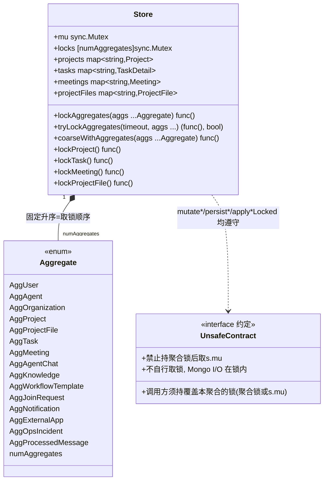
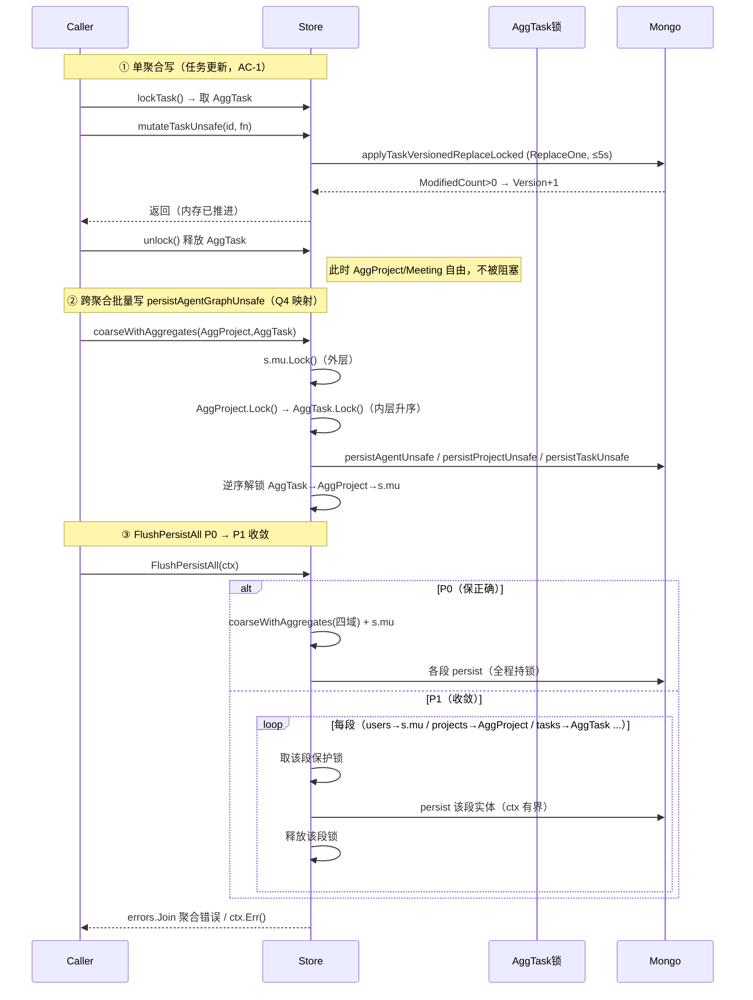
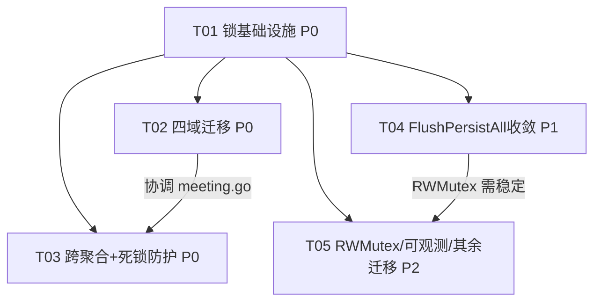

# T2.5 backend store 细粒度锁 —— 系统架构设计 + 任务分解（高见远 / Architect）

> ## ⚠️ 状态声明（2026-09-16）：本文的「已实现」部分已成历史
>
> **T2.5 的四域调用点迁移已于 2026-09-16 回退**（commit `0f63f64`）。`backend/internal/store`
> 运行时行为已恢复至基线 `4bcff06` —— 同一张 map 仍只有 `s.mu` 一把保护锁。
>
> 回退原因：**半迁移破坏互斥**。四域迁到聚合锁后，仍有 44 个函数只持 `s.mu` 读写同一批 map，
> 两把锁互不互斥 ⇒ 产生真实数据竞争（`-race` 已复现，生产可致进程崩溃）；同时 AC-1 零收益
> （46/50 迁移点仍取全局 `s.mu`）、22 处读并发退化为独占锁。
>
> **本文仍有价值的部分**：锁基础设施设计（`Aggregate` 枚举 / 固定升序取锁顺序 / `lockAggregates` /
> `coarseWithAggregates` / `flushSectionLock`）**已实现并保留在代码中**（`store_lock.go`），
> 供后续 T05 复用。但**本文中所有「四域已迁移」「当前实现为 X」的表述均已不成立**，
> 请勿据此推断当前代码状态。
>
> 完整决策记录见 [`docs/t2.5-rollback-decision-2026-09-16.md`](./t2.5-rollback-decision-2026-09-16.md)。
> **重启 T05 的前置条件：必须原子性整批迁移（44 函数 + 8 个 Unsafe 裸函数契约），禁止再分阶段。**
>
> <!-- ↓↓↓ 以下为 2026-09-15 设计原文，仅作留档 ↓↓↓ -->

下方为 8 项结构化交付物全文（中文，含 Go 接口签名与 mermaid 图）。**锁顺序与死锁防护已在设计阶段一次定死**，实现阶段不允许各自发挥。

---

## 0. 拍板项（Q1–Q4 结论）

| 问题 | 结论 |
|---|---|
| **Q1 锁粒度** | **聚合一把大锁（P0）**；按 id 分片留 P2（分片会成倍增加锁数与取锁成本，P0 不引入）。 |
| **Q2 读写锁** | **P0 用普通 `sync.Mutex`**；`sync.RWMutex` 留 P2（读路径现多用 `Lock`，改 RWMutex 需重新审视跨聚合读一致性，P0 不动）。 |
| **Q3 跨聚合策略** | **固定全局锁顺序（枚举升序）+ `lockAggregates` 排序取锁 helper**，从根上消除循环等待；`persistAgentGraphUnsafe` 等三聚合批量写采用「**粗粒度兜底模式**：`s.mu`（外层）+ 各被触及聚合锁（内层，固定顺序）」；辅以 `tryLock` 超时与 `debug` 构建下持锁追踪兜底。 |
| **Q4 锁归属** | 每个聚合一把锁；**`s.mu` 保留为粗粒度兜底锁**（既是兼容锁也是兜底锁）；非 P0 聚合在 P0 阶段仍由 `s.mu` 守护，P2 再迁到各自聚合锁；`persistAgentGraphUnsafe` 的取锁映射 = **`s.mu`(外层) + `[AggProject, AggTask]`(内层固定顺序)**（agents 仍属 `s.mu` 守护）。 |

**核心不变量（贯穿全程）：** ① 任何聚合锁的获取顺序恒为 `Aggregate` 枚举升序，禁止乱序/反向；② **持任一聚合锁时，禁止再获取 `s.mu`（反向嵌套）**——`s.mu` 只能作为最外层或在“聚合锁集合”之外单独使用；③ 每把 map 只有一个保护锁（迁移后为其聚合锁，迁移前为 `s.mu`），禁止同一 map 被两套锁并发保护。

---

## 1. 实现方案 + 框架选型

**框架选型：仅用 Go 标准库 `sync`，零新增第三方依赖。** 不引入 sharded-lock 库、不引入 deadlock 检测库（deadlock 防护靠固定顺序 + 自研 `tryLock` + `runtime`/watchdog，详见 §3/§7）。

**落地形态（关键决策 —— 兼容现有测试）：**
- **保留 `s.mu`，但语义从「全局唯一锁」降级为「粗粒度兜底锁」**：类型由 `sync.RWMutex` 改为 `sync.Mutex`（P0 不再需要其 RLock 语义；测试里直接 `s.mu.Lock()` 的代码全部继续编译通过）。
- **新增 `s.locks [numAggregates]sync.Mutex` 数组**：每聚合一把细粒度锁。P0 仅 `AggProject/AggProjectFile/AggTask/AggMeeting` 启用；其余聚合锁在 P0 定义但暂不使用（其 map 仍由 `s.mu` 守护），P2 启用。
- `streamMu`、`idemCacheMu` 保持原样（与本次改造无关）。
- `*Unsafe` 原语（含 `mutate*Unsafe`、`apply*VersionedReplaceLocked`、`persistXxxUnsafe`）**接口语义与内部实现不变**——它们仍是「调用方须已持锁」的裸原语，仅调用方从 `s.mu.Lock()` 改为 `s.lockAggregates(...)`。Mongo I/O 仍在锁内（这是预期收益点：临界区从全局降到单聚合）。

**取锁 helper（`store_lock.go` 新增）：**
```go
// 全局固定取锁顺序：Aggregate 枚举值升序即顺序。
type Aggregate int
const (
    AggUser Aggregate = iota          // users, usersByMail, userEvents, userNotifications,
                                     // userJoinRequests, userOrgIndex, userKnowledgeDocs,
                                     // userWorkflowTemplates, userSubscribers
    AggAgent                         // agents, agentByNode
    AggOrganization                  // organizations, orgMemberships, orgMemberIndex, llmConfigs
    AggProject                       // projects, projectMembers
    AggProjectFile                   // projectFiles, projectFileIndex, transferFileIndex
    AggTask                          // tasks, projectTasks, taskEvents, taskArtifacts, taskComments,
                                     // autoAdvanceStreak, planRejectNotify, planningStallCount,
                                     // planningStallLastRemind
    AggMeeting                       // meetings, projectMeetings, meetingMessages, meetingMessageIndex
    AggAgentChat                     // agentChats, activeAgentChats, agentChatBySession
    AggKnowledge                     // knowledgeDocs
    AggWorkflowTemplate              // workflowTemplates
    AggJoinRequest                   // joinRequests, trustRequestIndex
    AggNotification                  // notifications
    AggExternalApp                   // externalApps
    AggOpsIncident                   // opsIncidents, opsByDedupeKey, opsByTask, opsClearSince, opsSuppress
    AggProcessedMessage              // processedMessages
    numAggregates
)

// Store 锁字段（替换原 store.go:19 的单一全局锁的“细粒度”部分）
type Store struct {
    mu    sync.Mutex                 // 粗粒度兜底锁（原 s.mu 语义保留）：守护未迁移聚合 + 作为多聚合批量操作的外层锁
    locks [numAggregates]sync.Mutex  // 每聚合一把细粒度锁
    // streamMu / idemCacheMu 维持不变
    ... // 其余字段不动
}
```

---

## 2. 文件清单（相对路径，`backend/internal/store/` 下）

**P0 改动（核心）：**
1. `store.go` —— `mu` 字段类型 `RWMutex→Mutex`；新增 `locks [numAggregates]sync.Mutex` 字段；引入 `Aggregate` 枚举与 `numAggregates`；更新头部锁契约注释。
2. `store_lock.go`（**新增**）—— `Aggregate` 枚举常量的权威定义、固定顺序说明、`lockAggregates` / `tryLockAggregates`、单聚合便捷方法 `lockProject()/lockTask()/lockMeeting()/lockProjectFile()`、debug 构建下的持锁追踪与反向嵌套 panic、coarse-兜底模式 helper `coarseWithAggregates(...)`。
3. `store_project.go` —— 项目 CRUD 与单聚合 persist 调用点：`s.mu.Lock()` → `s.lockProject()`（或 `lockAggregates(AggProject)`）。
4. `store_project_file.go` —— 同上，改用 `lockProjectFile()`；创建文件时同步维护 `projectFileIndex`（同属 `AggProjectFile`，无跨聚合写）。
5. `store_task.go` —— 同上，改用 `lockTask()`；创建任务同步维护 `projectTasks`（同属 `AggTask`）。
6. `meeting.go` —— 纯单聚合会议 CRUD/persist 改用 `lockMeeting()`；**跨聚合读** `meeting.go:262`、`:762`（`s.projects[...]`）补 `lockAggregates(AggMeeting, AggProject)`。
7. `mongo_state.go` —— `persistAgentGraphUnsafe`（:1454）改为 coarse-兜底模式 `[s.mu + AggProject + AggTask]`；`FlushPersistAll`（:2100）P0 暂保留 `[s.mu + 四域聚合锁]` 全程（P1 再收敛）。
8. `workflow.go` —— 核对 `persistAgentGraphUnsafe` 全部调用点（:166/:238/:390/:764/:906/:913/:1012/:1259/:1440）的锁契约（调用前已通过 coarse-兜底模式持锁）。
9. `store_lock_test.go`（**新增**）—— 固定顺序单元断言、debug 持锁追踪单测、`Aggregate` 枚举值稳定单测。
10. `store_deadlock_test.go`（**新增**）—— 高并发随机交错多聚合写压测 ≥ N 分钟无死锁（watchdog + `runtime` 死锁探测；AC-3）。

**P1 改动：**
11. `mongo_state.go` —— `FlushPersistAll` 由「全程持 `[s.mu + 四域]`」改为「按 sweep 段取各自保护锁、段间释放」，保留 `errors.Join` 聚合与 ctx 中断语义（AC-5）。
12. `store_lock.go` —— 新增 flush 段级取锁 helper（如 `s.flushSectionLock(agg)`）。
13. `store_finegrain_bench_test.go`（**新增**）—— 单聚合 persist 并发基准，证明其它聚合 p99 不退化（AC-1）。

**P2 改动（不在 P0/P1，列出以便预留）：**
14. `store_lock.go` —— `Mutex→RWMutex`，新增 `rLockAggregates` + `rLockProject()` 等读锁便捷方法。
15. `observability.go`（**新增/改**）—— 每聚合锁等待/持有时长指标，复用现有 `metrics`。
16. `store_org.go / store_agent.go / store_user.go / store_knowledge.go / store_agent_chat.go / store_workflow_template.go / store_llm_config.go / store_join_request.go / store_external_app.go / store_artifact.go / store_planning.go / notification.go / ops_incident.go` —— 非 P0 聚合迁移到各自聚合锁。
17. `store_lock_order_ci_test.go`（**新增**）—— CI 锁顺序静态断言 / grep 护栏（AC-6）。

> 总计 P0 涉及 10 个文件（2 新增 + 8 改），满足「>10 个文件」预期（含 P1/P2 共 17 个）。

---

## 3. 数据结构与接口

### 3.1 聚合锁持有结构（Go）
```go
// Aggregate 即一致性边界（聚合）。枚举值升序 = 全局固定取锁顺序。
type Aggregate int
const ( /* 见 §1 枚举 */ )

type Store struct {
    mu    sync.Mutex                // 粗粒度兜底锁
    locks [numAggregates]sync.Mutex // 每聚合细粒度锁
    // —— 以下为 debug 构建（-tags debuglock）持锁追踪，生产零成本 ——
    // heldMask   uint32             // 当前 goroutine 持有的聚合位掩码（debug 专用）
    // coarseHeld bool               // 当前 goroutine 是否持 s.mu（debug 专用）
    // lockDbgMu  sync.Mutex         // 保护上述 debug 字段
}

// lockAggregates 按固定顺序（枚举升序、去重）获取给定聚合的锁，返回逆序释放闭包。
// 调用前若已持有任一聚合锁，debug 构建会 panic（禁止在持有聚合锁后再取更多聚合锁）。
// 禁止在本函数之后（持有聚合锁时）再获取 s.mu —— 由 debug 追踪捕获。
func (s *Store) lockAggregates(aggs ...Aggregate) func()

// tryLockAggregates 同上但带超时；任一锁在 timeout 内拿不到则返回 (unlock=nil, ok=false)，
// 调用方应回退到 coarse-兜底模式（s.mu + 聚合锁）以保证不死锁。P0 仅作防御性护栏，热路径默认用 lockAggregates。
func (s *Store) tryLockAggregates(timeout time.Duration, aggs ...Aggregate) (func(), bool)

// 单聚合便捷方法（P0 热路径）
func (s *Store) lockProject()     func() { return s.lockAggregates(AggProject) }
func (s *Store) lockProjectFile() func() { return s.lockAggregates(AggProjectFile) }
func (s *Store) lockTask()        func() { return s.lockAggregates(AggTask) }
func (s *Store) lockMeeting()     func() { return s.lockAggregates(AggMeeting) }

// coarseWithAggregates 粗粒度兜底模式：先取 s.mu（外层），再按固定顺序取给定聚合锁（内层）。
// 用于 persistAgentGraphUnsafe / FlushPersistAll 等触碰多 map 的批量操作；返回逆序释放闭包。
func (s *Store) coarseWithAggregates(aggs ...Aggregate) func()
```

### 3.2 `*Unsafe` 契约如何保持（零破坏 T2.x 语义）
- `mutateTaskUnsafe` / `mutateProjectUnsafe` / `mutateProjectFileUnsafe` / `persist*Unsafe` / `apply*VersionedReplaceLocked` **签名与实现不变**。
- **契约注释模板（每个 `*Unsafe` 顶部强制）：**
  > `// 调用方须已持有一把能覆盖本聚合的锁：本聚合细粒度锁（如 AggTask），或粗粒度兜底锁 s.mu。`
  > `// 禁止在持有本聚合锁后再获取 s.mu（反向嵌套，debug 构建 panic）。`
  > `// 本函数不自行取锁；Mongo I/O 在调用方所持锁内完成（临界区=单聚合，非全局）。`
- 零副作用不变量（store.go:545/574）、乐观锁 filter（`{_id, version: cur}`）、`healZeroVersion*` 自愈**原样保留**，因为它们只依赖「调用方持锁 + Mongo 权威」这一前提，与「锁是全局还是聚合」无关。

### 3.3 类图（mermaid classDiagram）


---

## 4. 程序调用流程

### 4.1 单聚合写路径（取锁 → 调 `*Unsafe` → 放锁）
以「任务更新 + 单聚合 persist」为例：
1. `unlock := s.lockTask(); defer unlock()`（仅持 `AggTask`）。
2. 修改 `s.tasks[id]` 内存字段。
3. `s.mutateTaskUnsafe(ctx, id, fn)` → 内部 `applyTaskVersionedReplaceLocked`（持 `AggTask` 内做 `ReplaceOne`，最坏 `MONGO_TIMEOUT=5s`）→ 成功推进 `Version`，失败回滚到进入前快照（零副作用不变量）。
4. `defer unlock()` 释放 `AggTask`。
> 期间 `AggProject/AggMeeting/AggProjectFile` 完全自由 → **AC-1 成立**（单聚合 persist 不阻塞其它聚合）。

### 4.2 跨聚合写 / 批量写（固定顺序取多锁）
**`persistAgentGraphUnsafe`（P0 coarse-兜底模式）：**
1. `unlock := s.coarseWithAggregates(AggProject, AggTask)`（= 先 `s.mu.Lock()`，再按升序 `AggProject`→`AggTask`）。
2. 遍历 `s.agents[agentID]` → `persistAgentUnsafe`；遍历全部 `s.projects`（引用该 agent 的）→ `persistProjectUnsafe`；遍历全部 `s.tasks` → `persistTaskUnsafe`。
3. `defer unlock()` 逆序释放 `AggTask`→`AggProject`→`s.mu`。
> 顺序恒为 `s.mu < AggProject < AggTask`，与其它任何路径无逆序 → 无死锁（AC-3）。

### 4.3 `FlushPersistAll` 临界区收敛
- **P0（保持正确，暂不全收敛）：** `unlock := s.coarseWithAggregates(AggProject, AggProjectFile, AggTask, AggMeeting)` + `s.mu` 已含（agents/users/... 未迁移聚合由 `s.mu` 守护）→ 全程持所有保护锁，保证与 4 域热路径无竞态；停机回写完整性与 ctx 中断语义不变。`errors.Join` 聚合不变。
- **P1（收敛，AC-5）：** 改为「按 sweep 段取锁」：每段（users/agents→`s.mu`；projects→`AggProject`；tasks→`AggTask`；meetings→`AggMeeting`；...）取各自保护锁、处理完即释放，再取下一段。整轮 sweep 不再持单一长锁，持锁时长从「整轮」降到「单聚合/批次级」；`ctx` 到期仍立即中断整轮（每段前检查 `ctx`）；`errors.Join` 聚合不变。

### 4.4 关键时序（mermaid sequenceDiagram）


---

## 5. 任务列表（有序、含依赖、P0/P1 标注）

> 遵循「最大 5 任务、每任务 ≥3 文件、首任务=基础设施」约束；尽量仅依赖 T01。

**T01（P0，基础设施）** —— 锁基础设施
- 文件：`store.go`（字段重构）、`store_lock.go`（新增）、`store_lock_test.go`（新增）。
- 改什么：定义 `Aggregate` 枚举 + 固定顺序；`Store` 加 `locks [numAggregates]sync.Mutex`，`mu` 改 `Mutex`；实现 `lockAggregates/tryLockAggregates/coarseWithAggregates` + 单聚合便捷方法 + debug 持锁追踪。
- 验收：枚举值稳定单测；固定顺序断言；debug 反向嵌套 panic 单测；编译通过（现有 `s.mu` 引用零改动）。
- 依赖：无。优先级 **P0**。

**T02（P0，四域单聚合路径）** —— Project/ProjectFile/Task/Meeting 调用点迁移
- 文件：`store_project.go`、`store_project_file.go`、`store_task.go`、`meeting.go`（纯单聚合 CRUD+persist 调用点）。
- 改什么：所有「`s.mu.Lock()` → 对应 `lockXxx()`」；创建任务/会议/文件时同聚合内维护 `projectTasks`/`projectMeetings`/`projectFileIndex`（无跨聚合写）。
- 验收：`*_mongo_authority_test.go` 全绿（AC-4）；`go test -race ./internal/store/...` 全绿（AC-2）；`mutate*Unsafe` 零副作用不变量测试不变。
- 依赖：T01。优先级 **P0**。

**T03（P0-3，跨聚合一致性 + 死锁防护）** —— 跨聚合读补锁 + persistAgentGraphUnsafe 映射 + 死锁压测
- 文件：`meeting.go`（:262/:762 跨聚合读补 `AggProject`）、`mongo_state.go`（`persistAgentGraphUnsafe` coarse-兜底映射）、`workflow.go`（调用点契约核对）、`store_deadlock_test.go`（新增）。
- 改什么：`meeting.go` 两处跨聚合读改 `lockAggregates(AggMeeting, AggProject)`；`persistAgentGraphUnsafe` 改 `coarseWithAggregates(AggProject, AggTask)`；核对 `workflow.go` 9 个调用点。
- 验收：高并发随机交错多聚合写压测 ≥ N 分钟无死锁/挂死（watchdog + runtime 探测，AC-3）；`-race` 仍绿；grep 断言无「持聚合锁后取 s.mu」。
- 依赖：T01（与 T02 协调 `meeting.go`）。优先级 **P0**。

**T04（P1，FlushPersistAll 收敛 + 不阻塞）** —— 临界区收敛 + 单聚合 persist 不阻塞验证
- 文件：`mongo_state.go`（FlushPersistAll 段级取锁）、`store_lock.go`（新增 flush 段级取锁 helper）、`store_finegrain_bench_test.go`（新增）。
- 改什么：`FlushPersistAll` 由「全程 `[s.mu+四域]`」改为「按 sweep 段取各自保护锁、段间释放」；保留 `errors.Join` 与 ctx 中断语义。
- 验收：停机回写完整性不变（AC-5 语义）；并发基准证明单聚合 persist 期间其它聚合 p99 不退化（AC-1）；`-race` 绿。
- 依赖：T01（T03 的 coarse 模式已就位可复用）。优先级 **P1**。

**T05（P2，读优化/可观测/其余聚合迁移/CI）** —— RWMutex + 指标 + 非 P0 聚合迁移 + 锁顺序 CI 断言
- 文件：`store_lock.go`（Mutex→RWMutex + `rLockAggregates`）、`observability.go`（新增锁指标）、`store_org.go`/`store_agent.go`/`store_user.go`/`store_knowledge.go`/`store_agent_chat.go`/`store_workflow_template.go`/`store_llm_config.go`/`store_join_request.go`/`store_external_app.go`/`store_artifact.go`/`store_planning.go`/`notification.go`/`ops_incident.go`、`store_lock_order_ci_test.go`（新增）。
- 改什么：引入 RWMutex 支持并发读；每聚合锁等待/持有时长指标；非 P0 聚合从 `s.mu` 迁到各自聚合锁；CI 锁顺序静态断言。
- 验收：读路径并发度提升（基准）；指标可观测；所有 store 包测试绿；CI 锁顺序护栏通过。
- 依赖：T01、T04（RWMutex 需锁基础设施稳定）。优先级 **P2**。

### 任务依赖图（mermaid graph）


---

## 6. 依赖包列表

**无新增第三方依赖。** 仅使用 Go 标准库 `sync`（Mutex / RWMutex / 自研 tryLock）。`runtime`（`runtime` goroutine dump 探测）与 `time` 均为标准库，用于死锁回归测试与 tryLock 超时，不引入外部包。CI 既有 `go test -race` 保持不变。

---

## 7. 共享知识（跨文件约定）

1. **全局锁顺序常量**：`Aggregate` 枚举定义于 `store_lock.go`（权威位置），值即取锁顺序；**禁止调整枚举值顺序而不同步更新所有 `coarseWithAggregates`/`lockAggregates` 调用**（CI `store_lock_order_ci_test.go` 与枚举稳定单测守护）。
2. **helper 命名约定**：多聚合用 `lockAggregates(...Aggregate)`；单聚合用 `lockXxx()`（如 `lockTask()`）；批量兜底用 `coarseWithAggregates(...)`；超时护栏用 `tryLockAggregates(timeout, ...)`。读锁（P2）用 `rLockAggregates`/`rLockXxx`。
3. **`*Unsafe` 契约注释模板**（每个 `*Unsafe` 顶部强制）：
   > `调用方须已持有一把能覆盖本聚合的锁（本聚合细粒度锁 或 粗粒度兜底锁 s.mu）。禁止在持有聚合锁后再获取 s.mu（反向嵌套）。本函数不自行取锁，Mongo I/O 在调用方所持锁内完成。`
4. **死锁防护约定**：
   - 固定顺序（`lockAggregates` 内部按枚举升序去重排序）是主防线，构造上消除循环等待。
   - `tryLock` 超时值常量 `aggregateTryLockTimeout`（建议 50ms，集中定义于 `store_lock.go`），仅作防御性护栏；超时即回退 `coarseWithAggregates`。
   - `debug` 构建（`-tags debuglock`）开启持锁追踪：持聚合锁后再取 `s.mu` → panic；用于 CI/本地提前抓回归（支持 AC-6）。
   - 死锁回归压测（`store_deadlock_test.go`）高并发随机交错 ≥ N 分钟 + watchdog goroutine + `runtime` 死锁探测（AC-3）。
5. **index 归属约定**：形如 `projectTasks/projectMeetings/projectFileIndex` 的「父→子」索引归入**子聚合**（与子记录同锁），以最小化热路径跨聚合写；唯一残留跨聚合访问是会议可见性读 `s.projects`（meeting.go:262/762），统一用 `lockAggregates(AggMeeting, AggProject)`。
6. **`s.mu` 角色**：永远可作「外层锁」或「单独锁」，但**绝不**在已持聚合锁后获取；非 P0 聚合在 P2 前一律由 `s.mu` 守护。

---

## 8. 待明确事项（需主理人/PM 拍板）

1. **死锁压测时长 N**：AC-3 要求「≥ N 分钟」，建议 CI 短跑（如 30s，带 watchdog）保实时性、nightly 长跑（如 10min）。请确认 N 与 CI/nightly 拆分。
2. **`tryLock` 超时值**：默认 50ms 是否可接受？或改为「首次即 coarse 兜底、不做 tryLock 尝试」（更简单，P0 推荐后者以降复杂度）。
3. **`projectMembers` 归属**：我归到 `AggProject`（成员变更属项目管理操作，非高频）。若 PM 认为成员变更应与 Org 强一致，可改归 `AggOrganization`——请确认。
4. **`llmConfigs`（orgID 维度）归属**：暂归 `AggOrganization`。若认为属平台级配置，可独立或归 `AggUser`（平台默认 `orgID=""`）。请确认。
5. **persistAgentGraphUnsafe 是否 P0 就细粒度化**：本设计 P0 用 coarse-兜底（`s.mu`+两聚合），P1 不改也满足验收。若 PM 希望 P0 就对其做「逐实体取锁释放」以降低罕见阻塞，可在 T03 追加——请确认是否必要。
6. **RWMutex 范围（P2）**：确认 P2 才引入，P0 全用 `Mutex`（含读路径）是否符合性能预期；若 P0 即需并发读优化，Q2 决策需上提到 P0。

> 以上 1–6 不影响 P0 核心架构落地；建议 T01 启动前先确认 1、2、5。
